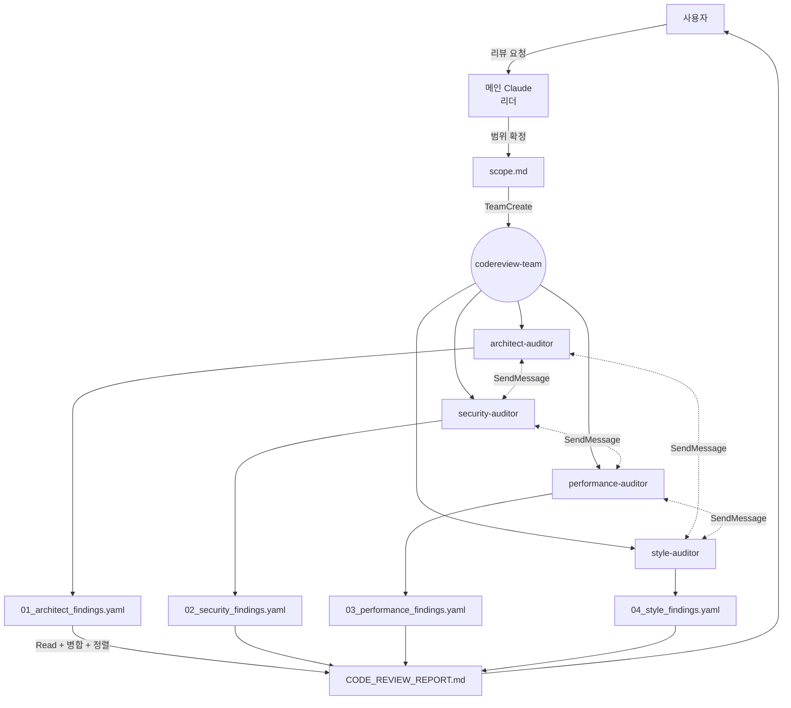

# Code Review Orchestrator

종합 코드 리뷰 팀을 조율하여 아키텍처·보안·성능·스타일 4영역의 감사 결과를 단일 리포트로 통합하는 워크플로우.

## 실행 모드: 에이전트 팀

4명 감사자 + 1명 리더 구조. 감사자 간 `SendMessage`로 교차 이슈가 실시간 공유되도록 `TeamCreate`로 구성한다. 서브 에이전트 모드를 선택하지 않는 이유: 교차 영역 이슈(보안↔성능, 아키텍처↔스타일) 공유가 리포트 품질의 핵심.

## 에이전트 구성

| 팀원 | agent_type | 역할 | 스킬 | 출력 |
|------|-----------|------|------|------|
| architect-auditor | `codereview-architect-auditor` | 아키텍처 감사 | codereview-architecture-audit | 01_architect_findings.yaml |
| security-auditor | `codereview-security-auditor` | 보안 취약점 감사 | codereview-security-audit | 02_security_findings.yaml |
| performance-auditor | `codereview-performance-auditor` | 성능 병목 감사 | codereview-performance-audit | 03_performance_findings.yaml |
| style-auditor | `codereview-style-auditor` | 스타일·가독성 감사 | codereview-style-audit | 04_style_findings.yaml |
| (리더 = 당신) | — | 구성·통합 | 이 스킬 | CODE_REVIEW_REPORT.md |

## 워크플로우

### Phase 1: 범위 확정

1. **사용자 입력 분석:**
   - 명시된 경로/파일 있음 → 그 범위 사용
   - "현재 브랜치", "PR", "diff" 언급 → `git diff main...HEAD --name-only`로 파일 목록 확보
   - "전체" 또는 미지정 → 사용자에게 확인: "전체 프로젝트 리뷰(대규모) / 최근 변경(diff) / 특정 경로 중 선택"
2. **규모 체크:**
   - 파일 수 > 500 → 사용자에게 경고, 증분 또는 모듈별 분할 제안
   - 파일 수 < 5 → 단일 영역 리뷰 권장 (4영역 오버킬)
3. **타임스탬프 기반 작업 디렉토리 생성:**
   ```
   _workspace/codereview/{YYYYMMDD-HHMM}/
   ├── 00_input/scope.md     # 리뷰 범위 기록
   ├── 01_architect_findings.yaml (감사자가 생성)
   ├── 02_security_findings.yaml
   ├── 03_performance_findings.yaml
   └── 04_style_findings.yaml
   ```
4. **scope.md 작성:** 대상 파일 리스트, 기준 브랜치, 제외 대상(node_modules, generated 등).

### Phase 2: 팀 구성

`TeamCreate`로 4명 동시 생성. 각 팀원 프롬프트에 필수로 포함할 내용:

```
TeamCreate(
  team_name: "codereview-team",
  members: [
    {
      name: "architect-auditor",
      agent_type: "codereview-architect-auditor",
      model: "opus",
      prompt: "리뷰 범위: _workspace/codereview/{ts}/00_input/scope.md 를 Read.
               `codereview-architecture-audit` 스킬을 사용해 감사.
               공통 finding 스키마: codereview-orchestrator/references/finding-schema.md 준수.
               심각도 기준: codereview-orchestrator/references/severity-matrix.md 준수.
               출력: _workspace/codereview/{ts}/01_architect_findings.yaml
               교차 이슈 발견 시 해당 감사자에게 SendMessage.
               완료 시 리더에게 SendMessage('아키텍처 감사 완료, {n}건 발견, critical {m}건')."
    },
    {
      name: "security-auditor",
      agent_type: "codereview-security-auditor",
      model: "opus",
      prompt: "(보안 담당으로 동일 형식, 출력은 02_security_findings.yaml)"
    },
    {
      name: "performance-auditor",
      agent_type: "codereview-performance-auditor",
      model: "opus",
      prompt: "(성능 담당, 03_performance_findings.yaml)"
    },
    {
      name: "style-auditor",
      agent_type: "codereview-style-auditor",
      model: "opus",
      prompt: "(스타일 담당, 04_style_findings.yaml)"
    }
  ]
)
```

작업 등록:

```
TaskCreate(tasks: [
  { title: "아키텍처 감사", assignee: "architect-auditor" },
  { title: "보안 감사", assignee: "security-auditor" },
  { title: "성능 감사", assignee: "performance-auditor" },
  { title: "스타일 감사", assignee: "style-auditor" },
  { title: "리포트 통합", assignee: "(리더)", depends_on: ["아키텍처 감사", "보안 감사", "성능 감사", "스타일 감사"] }
])
```

### Phase 3: 병렬 감사 + 교차 조율

**실행 방식:** 팀원들이 자체 조율하며 병렬 감사.

**리더의 역할:**
- 진행 상황 모니터링 (`TaskGet`, 유휴 알림 수신)
- 특정 감사자가 critical 발견 시 즉시 인지
- 감사자가 막혔을 때(30분 이상 무응답) `SendMessage`로 상태 확인
- **감사자의 YAML 생성에 개입하지 않음** — 내용 검열 금지

**교차 통신 기대 패턴:**
- security → performance: ReDoS, 타이밍 공격 등 겹치는 영역
- architect → security/style: 구조적 문제의 파급 효과
- performance ↔ architect: 구조적 병목
- 모든 감사자 → 리더: critical 발견 즉시 알림

### Phase 4: 리포트 통합

1. 모든 작업 완료 확인 (`TaskGet` 전부 completed)
2. 4개 YAML Read, 파싱 실패 시 해당 감사자에게 재생성 요청
3. `references/integration-guide.md` 절차 따라:
   - 교차 이슈 탐지(related_findings + 위치 근접)
   - 영역×심각도 매트릭스 생성
   - 심각도·신뢰도 기준 정렬
   - 동일 이슈 중복 병합
4. 최종 Markdown 생성 — 사용자 지정 경로 또는 `CODE_REVIEW_REPORT.md`
5. 자가 점검 체크리스트 실행 (integration-guide.md의 품질 검증 섹션)

### Phase 5: 정리

1. 팀원에게 종료 SendMessage
2. `TeamDelete`로 팀 해체
3. `_workspace/codereview/{timestamp}/` **보존** (삭제 금지 — 사후 추적용)
4. 사용자 보고: 리포트 경로 + 3~5줄 요약

## 데이터 흐름



## 에러 핸들링

| 상황 | 전략 |
|------|------|
| 감사자 1명 실패 | 1회 재시작. 재실패 시 그 영역 없이 진행, 리포트 상단에 "{영역} 미포함: 사유" 명시 |
| 감사자 2명+ 실패 | 사용자에게 중단 여부 확인. 계속 시 부분 리포트 생성 |
| YAML 파싱 실패 | SendMessage로 수정 요청 (1회). 불가 시 원본 첨부 + "구조화 실패" 태그 |
| 교차 판단 상충 | 삭제 금지. "검토 필요" 섹션에 양측 기록 |
| 범위 과다(파일 >500) | 증분/모듈별 분할 제안, 사용자 확정 후 진행 |
| critical 과다(>5) | 리더가 재검토 요청 가능 — 감사자의 심각도 인플레이션 여부 확인 |
| `_workspace/` 쓰기 실패 | 즉시 중단, 권한/공간 문제 사용자에게 보고 |

## 테스트 시나리오

### 정상 흐름

1. 사용자: "이 프로젝트 종합 리뷰해줘"
2. Phase 1: 범위 확인 → "전체 src/" 선택 → 87개 파일
3. Phase 2: TeamCreate(4 members), TaskCreate(5 tasks)
4. Phase 3: 4명 병렬 감사, 약 3개의 교차 SendMessage 교환
5. Phase 4: YAML 4개 파싱 성공 → 통합 리포트 생성 (43개 발견, critical 1, high 6)
6. Phase 5: 팀 해체, 리포트 경로 보고
7. 예상 결과: `CODE_REVIEW_REPORT.md` 생성, `_workspace/` 보존

### 에러 흐름

1. Phase 3에서 security-auditor가 25분간 무응답
2. 리더가 SendMessage로 상태 확인 → 응답 없음
3. 1회 재시작 시도 (새 member로 대체 또는 same member 재호출)
4. 재실패 시 security 영역 없이 통합
5. 리포트 상단: "⚠️ 보안 감사 실패 (타임아웃). 별도 `codereview-security-audit` 스킬로 재실행 권장."
6. 나머지 3영역 발견만 포함한 부분 리포트 제출

## 단일 영역 요청 처리

사용자가 "보안 리뷰만 해줘" 같은 단일 영역을 명시하면:
- 이 오케스트레이터가 아닌 해당 감사 스킬(`codereview-security-audit`)을 직접 사용
- 이 경우 팀 구성 불필요, 단일 Agent 호출로 충분

## 세부 로직 참조

- 발견 YAML 형식: `references/finding-schema.md`
- 심각도 기준: `references/severity-matrix.md`
- 통합 절차: `references/integration-guide.md`
