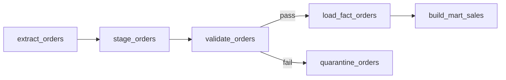

# ETL Design

데이터가 소스에서 목적지까지 이동·변환되는 흐름을 설계하는 방법론. 실패·지연·중복 상황에서도 정합성을 보장하는 메커니즘을 명시한다.

## 작성 목표

산출물은 `_workspace/datapipeline/{ts}/02_etl_design.md`. 구현자가 이 문서만으로 각 단계의 책임과 경계 조건을 파악해 코드를 작성할 수 있어야 한다.

## 설계 원칙

- **상태는 외부화** — 오프셋·체크포인트는 파이프라인 런타임이 아닌 외부 스토어(메타 DB, 체크포인트 파일)에. 재시작 시 복원 가능해야 한다.
- **작게 쪼개고 재시도 가능하게** — 태스크는 멱등성을 가지도록 설계. 5분~1시간 단위 파티션이 일반적 절충.
- **at-least-once + 다운스트림 dedup** 기본 — exactly-once는 비용이 크다. 실제 exactly-once가 꼭 필요한 경로만 별도 취급.
- **경계에서 계약** — 소스와 싱크 사이 계약(format, 필수 필드, 시간 기준)을 명시. 계약 위반은 staging에서 차단.
- **배치 vs 스트리밍 결정 기준** — 지연 요구, 데이터 양, 운영 복잡도, 비용. 분 단위 이하는 스트리밍, 그 이상은 배치부터 검토. 람다 아키텍처는 복잡도 감당 가능할 때만.
- **스키마 드리프트는 정책 결정** — 자동 반영 / 차단 / 격리+알림 중 선택. 무정책은 장애의 원인.
- **수동 복구 절차를 필수로 포함** — "자동 복구만"은 현실적이지 않다. 실패 시 수동 재실행 절차를 문서화한다.

## 워크플로우

### Step 1: 입력 확인

- 리더 브리프의 소스 목록·지연 요구·운영 환경을 Read
- schema-designer의 `01_schema_design.md`를 Read (초안 상태여도 파티션 키·감사 컬럼 확인)
- 불명확한 소스 접근 방식은 SendMessage로 리더에게 확인

### Step 2: 소스별 추출 전략 결정

소스별로 표 작성. 열:
- 소스명
- 접근 방식 (풀/푸시)
  - 풀: REST API 폴링, DB 쿼리, 파일 리스팅, FTP/S3 리스트
  - 푸시: webhook, Kafka 토픽, CDC(Debezium/DMS), Pub/Sub
- 증분 방식
  - high-water mark (updated_at, id)
  - CDC 로그 포지션(LSN, binlog)
  - 전체 스냅샷
- 주기 / 트리거 (cron, 이벤트, 수동)
- 예상 처리량 (records/s or records/run)
- 스키마 드리프트 처리 정책
- 에러 시 라우팅

**기본 선택 가이드:**
- 소스가 API이고 변경 추적 가능 → REST + incremental(updated_at)
- 소스가 DB이고 실시간 필요 → CDC
- 소스가 DB이고 배치 허용 → 증분 쿼리 (updated_at > 지난 실행)
- 소스가 이벤트 버스 → 스트리밍 컨슈머
- 소스가 파일 덤프 → 파일 리스팅 + 새 파일만 처리

### Step 3: 변환 단계 설계

파이프라인 단계(stage)를 정의한다. 각 단계:
- 입력 스키마 (이전 단계 출력 또는 raw)
- 처리 로직 요약
- 출력 스키마 (다음 단계 입력)
- 실행 엔진 (SQL / Spark / Flink / Python / dbt / Airbyte / Fivetran 중 일반 카테고리)
- 상태 요구 (stateless / windowed / keyed state)

**단계 분리 기준:**
- 책임(정제, 표준화, 조인, 집계) 단위로 분리
- 재시도·재실행 단위를 기준으로 분리
- 엔진이 다르면 분리 (SQL vs 코드 변환)

**ELT 선택**: 변환을 웨어하우스 내에서 수행 (dbt 스타일). 선택 조건:
- 웨어하우스가 변환 부하 감당 가능
- 변환이 SQL로 표현 가능
- 데이터 양이 네트워크 이동보다 저장이 저렴

**ETL 선택**: 외부 변환 엔진 사용. 선택 조건:
- 복잡한 비SQL 변환 (ML 피처, 이미지, 자연어)
- 소스와 목적지 사이 네트워크 비용이 큼
- 웨어하우스가 변환 부하 감당 어려움

### Step 4: 로드 패턴 결정

목적지 테이블별로:
- **append-only**: 이벤트/로그. 중복은 쿼리 측 dedup.
- **upsert**: 자연키 기준 존재 시 갱신, 없으면 삽입. 디멘전 Type 1.
- **merge (SCD Type 2)**: 변경 감지 → 이전 레코드 마감(valid_to = now) + 신규 레코드 삽입.
- **overwrite (full refresh)**: 작은 lookup/reference 테이블. 매 실행 전체 교체.
- **partition-level replace**: 특정 파티션만 원자적 교체. 백필·재실행에 유리.

### Step 5: 멱등성·체크포인팅 설계

각 소스·변환 단계별로:
- **dedup 키** — 같은 입력을 중복 수신했을 때 중복 적재를 막는 키 (source + source_id + content_hash)
- **high-water mark** — 증분 처리의 경계 (last_processed_updated_at, last_offset)
- **commit 경계** — 어디서 "성공했다"고 선언하고 체크포인트를 저장하는가
- **외부 상태 저장소** — 체크포인트·메타 DB 위치

**검증 가능한 멱등성 기준:** 같은 배치를 2회 실행해도 목적지 상태가 동일해야 한다. 문서에 이 기준을 기술한다.

### Step 6: 오케스트레이션 DAG

태스크 그래프 설계. 표현:
- 노드: 태스크 (추출/변환/적재/검증/알림)
- 에지: 의존 관계 (depends_on, 트리거 조건)
- 태스크 단위는 실패 격리 가능한 크기 (5분~1시간)

Mermaid flowchart로 시각화:


**오케스트레이터 선택**: Airflow / Prefect / Dagster / Temporal / Step Functions / cron+스크립트 중 일반 카테고리 제시. 프로젝트 맥락 맞춰 제안하되 고유 기능 전제 금지.

### Step 7: 스케줄 및 트리거

- 고정 주기 (cron): 일 단위 / 시간 단위 / 분 단위
- 이벤트 트리거: 파일 도착, 업스트림 완료, 메시지 수신
- 수동 트리거: 백필, 일회성 재처리
- 백프레셔: 상류가 밀리면 하류가 속도 조절하도록 설계

### Step 8: 재시도·실패 라우팅

태스크별 재시도 정책:
- 최대 시도 수 (3회 기본)
- 백오프 (exponential, jitter)
- 타임아웃 (태스크별 예상 시간 × 2~3배)
- 최종 실패 라우팅
  - DLQ(dead letter queue) — 스트리밍
  - quarantine 테이블 — 배치
  - 알림 + 수동 복구 — 치명적 실패

**무한 루프 방지:** 재시도가 근본 원인 해결 없이 반복되지 않도록 "영구 실패 판정" 기준 명시 (예: 같은 에러 3회 연속 → 알림 후 더 이상 재시도 안 함).

### Step 9: 백필·재처리 절차

과거 데이터 재처리 전략:
- **파티션 단위 재실행** — 특정 날짜 범위만 재처리. 파티션이 시간 기준일 때 효과적.
- **증분 패치** — 변경된 레코드만 재처리. CDC·change log가 있을 때.
- **전체 재처리** — 최후의 수단. 비용·시간 큼. 대안 먼저 검토.

백필 실행 주의점:
- 생산 파이프라인과 리소스 경합 회피 (별도 슬롯, 주말 실행)
- 체크포인트 덮어쓰기 방지 (백필용 별도 오프셋)
- 다운스트림 알림 (소비자가 데이터 변경을 인지)

### Step 10: 스키마 드리프트 대응

소스 스키마가 변경된 경우 3가지 정책 중 선택:
- **자동 반영** — 신규 컬럼 자동 추가. 빠르지만 downstream 예기치 못한 영향.
- **차단 + 알림** — 계약 위반으로 간주, 파이프라인 중단. 안전하지만 가용성 낮음.
- **격리 + 알림** — 문제 레코드만 격리, 나머지는 처리 계속. 균형.

**기본 권장: 차단 + 알림** (프로덕션 데이터 무결성 우선). 자동 반영은 raw 레이어까지만, 하류 전파는 수동 승인.

## 산출물 템플릿

```markdown
# 02 ETL Design

## 가정(Assumptions)
- 소스 접근 방식: ...
- 지연 목표: ...
- 운영 환경: ...

## 데이터 플로우 개요
(Mermaid flowchart)

## 소스별 추출 전략
| 소스 | 접근 | 증분 방식 | 주기 | 처리량 | 드리프트 정책 |
|------|------|-----------|------|--------|---------------|
| ... | | | | | |

## 변환 단계
### stage_{n}: {이름}
- 입력 스키마: ...
- 처리 로직: ...
- 출력 스키마: ...
- 실행 엔진: (SQL / Python / Spark 등)
- 상태 요구: ...

## 로드 패턴
| 목적지 테이블 | 패턴 | 키 | 비고 |
|---------------|------|------|------|
| ... | | | |

## 멱등성·체크포인팅
### 각 소스
- dedup 키: ...
- high-water mark: ...
- 체크포인트 저장소: ...
- 멱등성 검증 기준: ...

## 오케스트레이션 DAG
(Mermaid)

## 스케줄·트리거
| 태스크 | 스케줄 | 트리거 |
|--------|--------|--------|
| ... | | |

## 재시도·실패 라우팅
| 태스크 | 최대 시도 | 백오프 | 타임아웃 | 최종 실패 시 |
|--------|-----------|--------|----------|--------------|
| ... | | | | |

## 백필 절차
- 지원 범위: ...
- 실행 방법: ...
- 생산 파이프라인 영향 최소화: ...

## 스키마 드리프트 대응
- 정책: (차단/격리/자동)
- 감지 방법: ...
- 대응 절차: ...

## 용량·처리량 추정
- 피크 처리량: ...
- 병렬화 단위: ...
- 병목 예측: ...

## 대안 및 트레이드오프
### 대안 A: 배치 중심
- 장점: ...
- 단점: ...
- 적합 조건: ...

### 대안 B: 스트리밍 중심
- ...

## 열린 질문
```

## 팀 협업 체크리스트

- [ ] schema-designer와 파티션 키 합의 (SendMessage)
- [ ] schema-designer의 감사 컬럼을 로드 시 자동 주입
- [ ] validator와 변환 단계 목록 공유 → 검증 삽입 포인트 요청
- [ ] observer에게 단계별 메트릭 후보(처리량·지연·에러율) 공유
- [ ] "열린 질문"을 리더에게 SendMessage

## 금지 사항

- 수동 개입 없는 100% 자동 설계 (실패 경로 누락)
- exactly-once를 전제로 설계 (비용 정당화 없음)
- 체크포인트를 파이프라인 런타임 메모리에만 보관
- 단일 거대 태스크 (실패 격리 불가)
- 오케스트레이터 고유 기능 전제 (SubDAG 같은 기능 의존 전 일반 해법 먼저)
- 스키마 드리프트 정책 생략
- 백필 절차 생략
