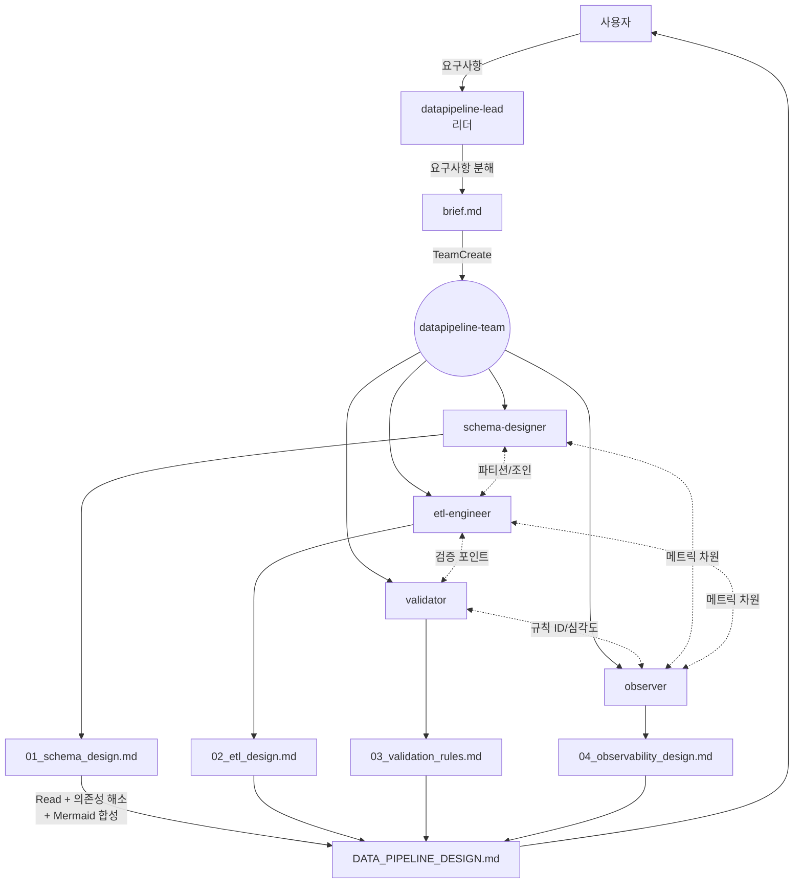

# Data Pipeline Design Orchestrator

스키마·ETL·검증·관측성 4영역의 설계안을 에이전트 팀으로 병렬 수립한 뒤 단일 설계 문서로 통합하는 워크플로우.

## 실행 모드: 에이전트 팀

리더(datapipeline-lead) + 4명 전문가 구조. 전문가 간 `SendMessage`로 설계 의사결정이 실시간 공유되도록 `TeamCreate`로 구성한다. 서브 에이전트 모드를 쓰지 않는 이유: 스키마↔ETL, ETL↔검증, 검증↔관측성 간 교차 의사결정(파티션 키, 검증 삽입 포인트, 메트릭 차원)이 설계 품질의 핵심이다.

## 계층적 위임을 팀 평탄화로 구현

사용자 요구가 "계층적 위임"이지만 에이전트 팀은 중첩 불가(팀원이 자체 팀 생성 불가)다. 1단계(리더 + 4 전문가) 팀으로 평탄화하되, 리더가 상위 영역 의사결정을 주도하고 전문가는 세부 설계를 담당하는 **책임 계층**을 유지한다. 깊이 3단계 이상은 지연·컨텍스트 손실이 커져 권장하지 않는다.

## 에이전트 구성

| 팀원 | agent_type | 역할 | 스킬 | 출력 |
|------|-----------|------|------|------|
| schema-designer | `datapipeline-schema-designer` | 레이어·엔티티·키·타입·진화 설계 | datapipeline-schema-design | 01_schema_design.md |
| etl-engineer | `datapipeline-etl-engineer` | 추출·변환·적재·오케스트레이션 설계 | datapipeline-etl-design | 02_etl_design.md |
| validator | `datapipeline-validator` | 규칙·심각도·격리 설계 | datapipeline-validation-rules | 03_validation_rules.md |
| observer | `datapipeline-observer` | SLI/SLO·메트릭·알림·런북 설계 | datapipeline-observability | 04_observability_design.md |
| (리더 = 당신) | `datapipeline-lead` | 요구사항 분해·통합 | 이 스킬 | DATA_PIPELINE_DESIGN.md |

## 워크플로우

### Phase 1: 요구사항 분해

1. **브리프 수집:** 사용자 입력에서 다음을 추출.
   - 도메인 / 비즈니스 맥락
   - 데이터 소스 (종류, 개수, 접근 방식)
   - 규모 추정 (레코드 수/일, 바이트/일, QPS)
   - 지연 요구 (배치 / 준실시간 / 실시간 / 혼합)
   - 다운스트림 소비자 (BI / ML / 서비스)
   - 운영 환경 / 예산 제약 / 선호 스택
   - SLA·품질 요구

2. **누락 정보 질의:** 브리프에 중대한 공백이 있으면 3개 이하의 질문으로 사용자에게 확인. 4개 이상 필요하면 단계적으로 분할 질의.

3. **타임스탬프 기반 작업 디렉토리 생성:**
   ```
   _workspace/datapipeline/{YYYYMMDD-HHMM}/
   ├── 00_brief.md            # 리더가 정리한 요구사항 브리프
   ├── 01_schema_design.md    # 전문가가 생성
   ├── 02_etl_design.md
   ├── 03_validation_rules.md
   └── 04_observability_design.md
   ```

4. **brief.md 작성:** 위에서 추출한 정보 + "가정(assumptions)" 섹션(불명확 사항에 대한 기본값).

### Phase 2: 팀 구성

`TeamCreate`로 4명 동시 생성. 각 팀원 프롬프트에 필수로 포함할 내용:

```
TeamCreate(
  team_name: "datapipeline-team",
  members: [
    {
      name: "schema-designer",
      agent_type: "datapipeline-schema-designer",
      model: "opus",
      prompt: "브리프: _workspace/datapipeline/{ts}/00_brief.md Read.
               `datapipeline-schema-design` 스킬을 사용해 설계.
               출력: _workspace/datapipeline/{ts}/01_schema_design.md
               etl-engineer와 파티션 키·조인 패턴 합의(SendMessage).
               validator·observer 요청에 응답.
               완료 시 리더에게 SendMessage('스키마 초안 완료, 엔티티 {n}개, 대안 {k}개')."
    },
    {
      name: "etl-engineer",
      agent_type: "datapipeline-etl-engineer",
      model: "opus",
      prompt: "(ETL 담당. 02_etl_design.md. schema-designer와 파티션 합의, validator와 검증 포인트 합의, observer와 메트릭 지점 공유)"
    },
    {
      name: "validator",
      agent_type: "datapipeline-validator",
      model: "opus",
      prompt: "(검증 담당. 03_validation_rules.md. schema-designer의 제약과 중복 제거, etl-engineer의 단계 경계에 검증 삽입, observer와 규칙 ID 공유)"
    },
    {
      name: "observer",
      agent_type: "datapipeline-observer",
      model: "opus",
      prompt: "(관측성 담당. 04_observability_design.md. 모든 전문가로부터 메트릭/차원 후보 수집)"
    }
  ]
)
```

작업 등록:

```
TaskCreate(tasks: [
  { title: "스키마 설계", assignee: "schema-designer" },
  { title: "ETL 설계",   assignee: "etl-engineer",  depends_on: ["스키마 설계 초안"] },
  { title: "검증 규칙",   assignee: "validator",     depends_on: ["스키마 설계 초안", "ETL 설계 초안"] },
  { title: "관측성 설계", assignee: "observer",      depends_on: ["ETL 설계 초안", "검증 규칙 초안"] },
  { title: "설계 통합",   assignee: "(리더)",         depends_on: ["스키마 설계", "ETL 설계", "검증 규칙", "관측성 설계"] }
])
```

> "초안" 의존성 사용 이유: 완전한 확정본을 기다리면 전체 파이프라인이 직렬화된다. 초안 70% 수준에서 다음 단계가 시작 가능하도록 설계했다. SendMessage로 변경 사항을 전파한다.

### Phase 3: 병렬 설계 + 교차 조율

**실행 방식:** 팀원들이 자체 조율하며 설계.

**리더의 역할:**
- 진행 상황 모니터링 (`TaskGet`, 유휴 알림 수신)
- 전문가가 중대한 전제 충돌을 보고하면 사용자에게 되묻기
- 특정 전문가가 30분 이상 무응답이면 `SendMessage`로 상태 확인
- **전문가의 설계 판단에 개입하지 않음** — 내용 재작성 금지. 통합이 리더의 몫.

**교차 통신 기대 패턴:**
- schema-designer → etl-engineer: 스키마 초안 공유 시점, 파티션 키 합의
- etl-engineer → validator: 변환 단계 목록 공유, 검증 삽입 포인트
- validator → observer: 규칙 ID 목록, 심각도, 알림 우선순위
- schema-designer/etl-engineer/validator → observer: 각자의 메트릭 차원 후보
- 모든 전문가 → 리더: 전제 충돌·상충 설계 발견 시 즉시 알림

### Phase 4: 설계 통합

1. 모든 작업 완료 확인 (`TaskGet` 전부 completed)
2. 4개 설계 문서 Read
3. `references/integration-guide.md` 절차에 따라:
   - 전제 일관성 검증 (예: 규모 추정이 영역별로 다르면 brief.md 기준으로 통일)
   - 의사결정 상충 탐지 (영역별 결정이 서로 부정하는지)
   - 데이터 플로우 다이어그램 합성 (Mermaid)
   - 트레이드오프 및 대안 통합 섹션 작성
   - 운영 체크리스트 생성 (단계별 배포·운영 체크포인트)
4. 최종 Markdown 생성 — 사용자 지정 경로 또는 `DATA_PIPELINE_DESIGN.md`
5. 자가 점검 체크리스트 실행 (references/integration-guide.md의 품질 검증 섹션)

### Phase 5: 정리

1. 팀원에게 종료 SendMessage
2. `TeamDelete`로 팀 해체
3. `_workspace/datapipeline/{timestamp}/` **보존** — 중간 산출물은 재설계·감사 추적 자산
4. 사용자 보고: 설계 문서 경로 + 3~5줄 요약 (대안 개수, 주요 상충, 운영 체크포인트 수)

## 데이터 흐름



## 에러 핸들링

| 상황 | 전략 |
|------|------|
| 전문가 1명 실패 | 1회 재시작. 재실패 시 해당 영역 없이 진행, 최종 문서 상단에 "{영역} 설계 미완 (사유)" 명시 + 수동 보완 가이드 |
| 전문가 2명+ 실패 | 사용자에게 중단 여부 확인. 계속 시 부분 설계 문서 생성 |
| 전제 충돌 발견 | 리더가 사용자에게 되묻기. 미응답 시 가장 보수적 가정 채택, "가정" 섹션에 명시 |
| 전문가 간 설계 상충 | 삭제 금지. "트레이드오프 및 대안" 섹션에 병기, 선택 기준 명시 |
| 브리프 과소 | Phase 1에서 질의로 해결. 질의 후에도 불명확하면 일반적 가정으로 진행 |
| 요구가 모순 (저지연+일일배치 등) | 리더가 사용자에게 우선순위 확인. 답 없으면 설계 중단 |
| `_workspace/` 쓰기 실패 | 즉시 중단, 권한/공간 문제 사용자에게 보고 |

## 테스트 시나리오

### 정상 흐름

1. 사용자: "주문 이벤트를 웨어하우스로 적재하는 파이프라인 설계해줘"
2. Phase 1: 브리프 작성 → 3개 질문(지연, 규모, 스택) → brief.md 완성
3. Phase 2: TeamCreate(4 members), TaskCreate(5 tasks)
4. Phase 3: 4명 병렬 설계, schema↔etl·etl↔validator·모든→observer 사이 SendMessage 교환
5. Phase 4: 4개 설계 문서 통합 → DATA_PIPELINE_DESIGN.md (대안 3세트, 상충 1건 병기, 운영 체크포인트 12개)
6. Phase 5: 팀 해체, 경로 + 요약 보고

### 에러 흐름

1. Phase 3에서 observer가 25분 무응답
2. 리더가 SendMessage로 상태 확인 → 실패 응답
3. 1회 재시작 시도
4. 재실패 시 관측성 영역 없이 통합
5. 최종 문서 상단: "⚠️ 관측성 설계 미완(타임아웃). 별도 `datapipeline-observability` 스킬로 재실행 권장."
6. 나머지 3영역 설계만 포함한 부분 문서 제출

### 전제 충돌 흐름

1. Phase 1 브리프에 "분 단위 지연" + "일일 배치 허용" 동시 명시
2. 리더가 모순 감지, 사용자에게 우선순위 질의
3. 사용자: "분 단위가 우선"
4. brief.md에 결정 기록, 일일 배치 기대는 예외 경로(백필용)로 범위 조정
5. 설계 진행

## 단일 영역 요청 처리

사용자가 "스키마 설계만", "검증 규칙만 만들어줘" 같은 단일 영역을 명시하면:
- 이 오케스트레이터가 아닌 해당 설계 스킬을 직접 사용
  - 스키마만 → `datapipeline-schema-design`
  - ETL만 → `datapipeline-etl-design`
  - 검증만 → `datapipeline-validation-rules`
  - 관측성만 → `datapipeline-observability`
- 이 경우 팀 구성 불필요.

## 세부 로직 참조

- 최종 문서 템플릿 및 통합 절차: `references/integration-guide.md`
- 공통 브리프 템플릿 및 규모 시나리오: `references/brief-template.md`
