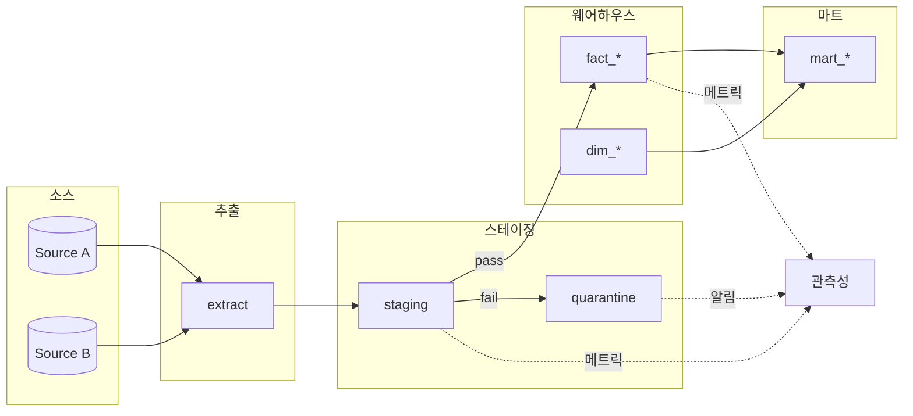

# Integration Guide

4개 전문가 설계 문서를 하나의 파이프라인 설계 문서로 통합하는 절차. 리더가 Phase 4에서 사용한다.

## 통합 대상

- `_workspace/datapipeline/{ts}/01_schema_design.md`
- `_workspace/datapipeline/{ts}/02_etl_design.md`
- `_workspace/datapipeline/{ts}/03_validation_rules.md`
- `_workspace/datapipeline/{ts}/04_observability_design.md`

## 통합 절차

### 1. 전제 일관성 검증

각 문서 상단의 "가정(Assumptions)" 섹션을 비교한다. 주요 파라미터가 영역별로 다르면 `brief.md` 기준으로 통일하거나, 영역별 차이를 최종 문서의 "가정" 섹션에 기록한다.

확인 항목:
- 규모 추정 (레코드/일, 바이트/일)
- 지연 목표
- 선호 스택
- SLA 수치

불일치 발견 시:
- 심각(근본 가정이 다름): 해당 전문가에게 SendMessage로 재확인 요청
- 경미(세부 차이): 최종 문서에 "영역별 전제 차이" 소절로 기록

### 2. 의사결정 상충 탐지

영역 간 결정이 서로 부정하는 경우를 찾는다:

| 상충 유형 | 예시 | 대응 |
|-----------|------|------|
| 스키마 ↔ ETL | schema가 완전 정규화, ETL이 dedup 키로 warehouse PK 가정 | "트레이드오프 및 대안" 섹션에 양안 병기 |
| ETL ↔ 검증 | ETL이 at-least-once, 검증이 unique PK 제약 기대 | dedup 메커니즘 또는 제약 완화 중 선택지 병기 |
| 검증 ↔ 관측성 | 검증 규칙 50개, 관측성이 알림 10개 이하 권장 | 심각도별 알림 대상 축소, 대시보드 관찰만 하는 규칙 분리 |
| 스키마 ↔ 관측성 | 스키마에 스키마_version 컬럼 없음, 관측성이 드리프트 메트릭 요구 | schema-designer에게 추가 요청하거나 관측성에서 대체 방법 제안 |

상충은 **삭제하지 않는다**. "트레이드오프 및 대안" 섹션에 양 입장 병기, 선택 기준 명시.

### 3. 데이터 플로우 다이어그램 합성

4개 문서의 부분 다이어그램을 합쳐 전체 플로우 다이어그램 작성. Mermaid 권장:



각 단계에서 실행되는 검증 규칙과 노출되는 메트릭을 노드 라벨 또는 인접 주석으로 표시.

### 4. 운영 체크리스트 생성

이 파이프라인을 실제로 운영 전환하기 위한 체크포인트를 영역별로 모은다:

- [ ] 스키마 마이그레이션 스크립트 작성·검토
- [ ] 스키마 진화 정책 팀 합의
- [ ] ETL 체크포인트 저장소 구축
- [ ] 오케스트레이터 DAG 코드화
- [ ] 재시도·DLQ 인프라 확보
- [ ] 백필 절차 드라이런
- [ ] 검증 규칙 카탈로그 DB/YAML 배포
- [ ] quarantine 테이블 생성 및 생애 주기 잡 배포
- [ ] baseline 수집 기간 설정 (신규 파이프라인)
- [ ] 메트릭 수집 엔드포인트 연결
- [ ] 알림 채널·에스컬레이션 구성
- [ ] 런북 작성 (최소 page 알림 전부)
- [ ] heartbeat 메트릭 배포
- [ ] 대시보드 3계층 구축
- [ ] 온콜 훈련 세션 1회

체크리스트는 전문가들이 이미 각자 문서에 기술한 항목을 리더가 모으는 것. 누락 발견 시 해당 전문가에게 확인.

### 5. 최종 문서 작성

섹션 순서 고정:

```markdown
# Data Pipeline Design

## 1. 개요
{도메인, 목적, 주요 이해관계자}

## 2. 전제(Assumptions)
{brief.md 기반 + 영역별 차이 주석}

## 3. 데이터 플로우
{Mermaid 전체 다이어그램}

## 4. 스키마 설계
{01_schema_design.md 주요 내용 요약 + 전체 링크/첨부}

## 5. ETL 설계
{02_etl_design.md 요약 + 링크}

## 6. 검증 규칙
{03_validation_rules.md 요약 + 링크}

## 7. 관측성 설계
{04_observability_design.md 요약 + 링크}

## 8. 트레이드오프 및 대안
{영역 간 상충 + 영역 내 대안을 한 곳에 수집}

## 9. 운영 체크리스트
{위 4번에서 생성한 체크리스트}

## 10. 열린 질문 및 후속 작업
{모든 영역의 "열린 질문" 수집}

## 부록 A~D: 각 영역 설계 문서 전문
(01~04 문서를 appendix로 포함 또는 링크)
```

## 자가 점검 체크리스트

최종 문서 저장 전에 다음을 확인:

- [ ] 4개 영역 모두 요약 포함 (누락된 영역이 있으면 "미완" 명시)
- [ ] 전제 섹션이 brief.md와 일치하거나 차이가 기록됨
- [ ] 데이터 플로우 다이어그램에 모든 소스·목적지·검증·quarantine·관측성 진입점 표시
- [ ] 트레이드오프 섹션에 최소 2~3개 선택지 병기
- [ ] 운영 체크리스트가 실행 가능한 구체성
- [ ] 열린 질문 섹션이 비어 있지 않거나 "모두 해소됨" 명시
- [ ] 부록의 개별 설계 문서 링크가 유효
- [ ] "가정" 모음에 수치 없는 문장("적정 수준", "충분히 낮게") 부재

자가 점검에서 실패 항목 발견 시 해당 전문가에게 SendMessage로 확인 후 보완.

## 상충을 병기하는 형식

```markdown
### 의사결정: {주제}
- **schema-designer의 제안:** 완전 정규화 (3NF)
  - 근거: 중복 제거, 변경 전파 단순
- **etl-engineer의 제안:** mart에서 일부 비정규화
  - 근거: 조인 비용 감소, 쿼리 성능
- **리더 평가:** 양안 모두 유효. **선택 기준:**
  - 주 쿼리가 복잡 조인 중심이고 처리량 높음 → 비정규화 mart
  - 변경이 잦고 일관성 중요 → 정규 유지
- **권장 기본값:** {조건에 따른 기본 권장}
- **결정자:** 사용자
```

## 금지 사항

- 전문가의 설계 판단을 리더가 재작성
- 상충 발견 시 한쪽을 삭제
- 자가 점검 건너뛰기
- 운영 체크리스트 없이 "설계 완료" 선언
- 최종 문서에서 "가정" 섹션 생략
