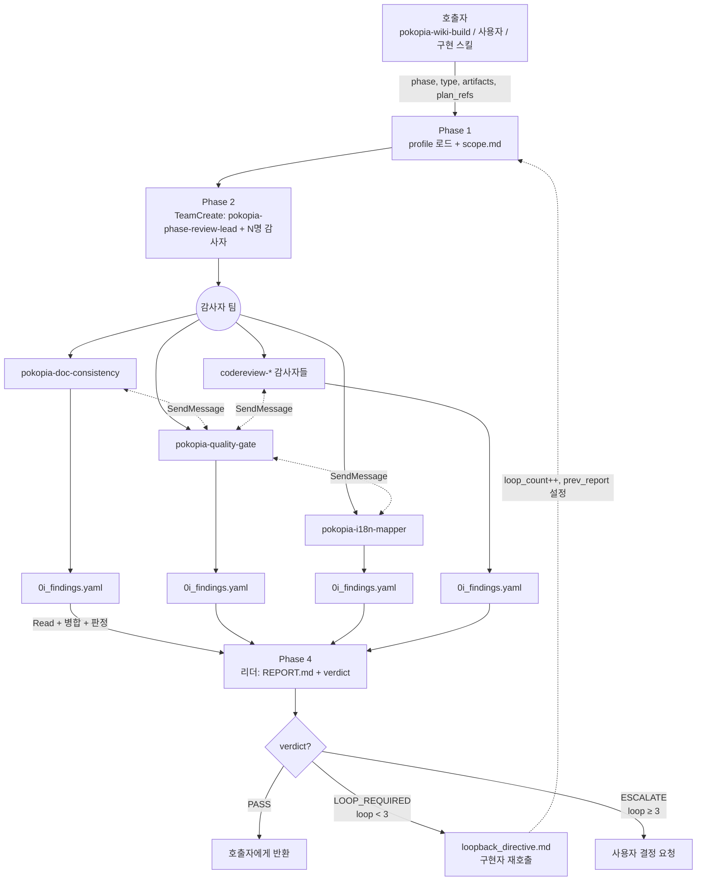

# Pokopia Phase Review Harness

Pokopia 구현 Phase 완료 시점에 **유형별 감사자 팀을 꾸려 병렬 감사**하고, Critical 이슈가 사라질 때까지 구현자에게 **루프백 지시**를 내리는 감사 전담 하네스.

## 실행 모드: 에이전트 팀

리더(`pokopia-phase-review-lead`) + 프로파일이 지정한 N명의 감사자로 `TeamCreate`. 감사자 간 교차 이슈(예: parser의 Zod 누락 ↔ schema의 ENUM 추가 여부)가 `SendMessage`로 실시간 공유되어야 리포트 품질이 확보된다. 서브 에이전트 모드를 선택하지 않는 이유: Phase 내부의 교차 의존성(파서 ↔ 스키마 ↔ i18n ↔ 문서)이 본질이기 때문.

## 입력 계약

하네스 호출 시 아래 컨텍스트를 전달받는다:

| 필드 | 필수 | 설명 |
|---|---|---|
| `phase` | ✅ | Phase 번호 (예: `1`, `4`) |
| `type` | ✅ | Phase 유형 — `schema` / `parser` / `crawler` / `api` / `qa` / `docs` 중 하나 |
| `artifacts` | ✅ | 변경 산출물 경로 목록 (예: `["prisma/schema.prisma", "src/parsers/cooking.ts"]`) |
| `plan_refs` | ✅ | 계획문서 포인터 (예: `["DATA_COLLECTION_PLAN.md#phase-1", "SCHEMA.md#entities"]`) |
| `prev_report` | 선택 | 이전 감사 리포트 경로 (재시도 시) |
| `loop_count` | 선택 | 현재 루프 횟수 (기본 0) |

호출자가 `type`을 생략하면 `artifacts` 경로 패턴으로 추론 시도 후 모호하면 사용자에게 확인 요청.

## 출력 계약

| 산출물 | 경로 |
|---|---|
| 통합 감사 리포트 | `_workspace/audit/phase-{N}/{timestamp}/REPORT.md` |
| 감사자별 finding YAML | `_workspace/audit/phase-{N}/{timestamp}/0{i}_{auditor}_findings.yaml` |
| 루프백 지시서 (LOOP_REQUIRED 시) | `_workspace/audit/phase-{N}/{timestamp}/loopback_directive.md` |
| 판정 결과 | 리포트 상단에 `VERDICT: PASS | LOOP_REQUIRED | ESCALATE` |

finding YAML은 **codereview-orchestrator의 공통 스키마를 재사용**한다 (`docs/finding-schema.md` 참조, 중복 스키마 금지).

## 워크플로우

### Phase 1: 컨텍스트 수립

1. **입력 파싱:** `phase`, `type`, `artifacts`, `plan_refs` 확인. `type` 누락 시 `artifacts` 경로로 추론:
   - `prisma/*` → `schema`
   - `src/parsers/*` → `parser`
   - `src/scrapers/*` / `src/fetchers/*` → `crawler`
   - `src/api/*` / `src/routes/*` → `api`
   - `docs/*.md` / `CRAWLING_STRATEGY.md` / `DATA_COLLECTION_PLAN.md` 등 → `docs`
   - 그 외 / 모호 → 사용자 확인
2. **프로파일 로드:** `docs/profiles/{type}.md` 를 Read하여 필수/권장 감사자 목록 확보.
3. **작업 디렉토리 생성:**
   ```
   _workspace/audit/phase-{N}/{YYYYMMDD-HHMM}/
   ├── 00_input/
   │   ├── scope.md       # phase, type, artifacts, plan_refs 정리
   │   └── profile.md     # 이번 감사에 참여할 감사자 목록
   ```
4. **scope.md 작성:** `phase`, `type`, 대상 산출물 경로, 참조 계획문서 섹션, `loop_count`, `prev_report`(있다면).

### Phase 2: 감사자 팀 구성

프로파일에서 얻은 감사자 목록을 기반으로 `TeamCreate`. 리더는 `pokopia-phase-review-lead` 에이전트.

감사자 매핑표 (프로파일 이름 → 실제 agent_type + 스킬):

| 감사자 이름 | agent_type | 스킬 |
|---|---|---|
| pokopia-doc-consistency | `pokopia-doc-strategist` | `pokopia-doc-consistency` |
| pokopia-quality-gate | `pokopia-qa-analyst` | `pokopia-quality-gate` |
| pokopia-i18n-mapper | `general-purpose` | `pokopia-i18n-mapper` |
| pokopia-ops-runner | `pokopia-ops-conductor` | `pokopia-ops-runner` |
| codereview-architecture | `codereview-architect-auditor` | `codereview-architecture-audit` |
| codereview-security | `codereview-security-auditor` | `codereview-security-audit` |
| codereview-performance | `codereview-performance-auditor` | `codereview-performance-audit` |
| codereview-style | `codereview-style-auditor` | `codereview-style-audit` |

각 팀원 프롬프트에 필수 포함 내용:

```
감사 범위: _workspace/audit/phase-{N}/{ts}/00_input/scope.md 를 Read.
계획문서 정합성 기준: scope.md의 plan_refs 섹션 준수.
사용할 스킬: {스킬 이름}
공통 finding 스키마: pokopia-phase-review-harness/docs/finding-schema.md (= codereview의 finding-schema 재사용).
심각도 기준: pokopia-phase-review-harness/docs/severity-rules.md 준수.
출력: _workspace/audit/phase-{N}/{ts}/0{i}_{auditor-name}_findings.yaml
이전 감사 리포트가 있으면 prev_report 경로를 Read하고 "이전 지적사항 해결 여부"를 finding에 태그(resolved/partial/unresolved/regressed).
교차 이슈 발견 시 해당 감사자에게 SendMessage.
완료 시 리더에게 SendMessage("{영역} 감사 완료, {n}건 발견, critical {m}건").
```

작업 등록:
```
TaskCreate(tasks: [
  { title: "{영역} 감사", assignee: "{auditor-name}" } ... (프로파일당 N개)
  { title: "리포트 통합 + 판정", assignee: "(리더)", depends_on: [모든 감사 작업] }
])
```

### Phase 3: 병렬 감사 + 교차 조율

**팀원들이 자체 조율**하며 병렬 감사. 리더는 모니터링만.

**교차 통신 기대 패턴 (Pokopia 특화):**
- parser ↔ schema: Zod 스키마 ↔ Prisma ENUM/타입 불일치
- parser ↔ i18n: 추출 필드 ↔ 다국어 키 누락
- crawler ↔ security: 헤더/쿠키에 시크릿 노출
- crawler ↔ ops-runner: rate limit / persona / cooldown 설정 상충
- docs-consistency ↔ 모두: SCHEMA.md·DATA_COLLECTION_PLAN.md·CRAWLING_STRATEGY.md·TECH_STACK.md 4문서 위반 감지 시 해당 영역 감사자에 알림
- quality-gate ↔ 모두: 파싱 실패율·교차 참조 깨짐·한국어 커버리지 이슈를 원인 영역에 피드

**리더의 역할:**
- 진행 상황 모니터링 (`TaskGet`)
- 감사자가 30분 이상 무응답 시 `SendMessage`로 상태 확인
- Critical 발견 즉시 인지 (SendMessage 수신)
- **감사자의 YAML에 개입하지 않음** — 내용 검열 금지

### Phase 4: 리포트 통합 + 판정

1. 모든 감사 작업 `completed` 확인. 파싱 실패한 YAML은 1회 재생성 요청.
2. finding 병합 + 정렬 (codereview-orchestrator의 integration-guide 준용):
   - 교차 이슈 탐지 (동일 파일/라인 2명 이상 지적)
   - 심각도 · 신뢰도 기준 정렬
   - 중복 병합, 상충은 병기
3. **판정 로직:**
   ```
   critical_count = sum(findings where severity == "critical")
   warning_count  = sum(findings where severity == "warning")

   if critical_count >= 1:
       verdict = "LOOP_REQUIRED"
   elif warning_count >= 1:
       verdict = "PASS"      # Warning은 기록 후 통과
   else:
       verdict = "PASS"
   ```
4. **리포트 생성** (`docs/templates/audit-report.md` 템플릿 사용). 리포트 상단에 `VERDICT` 명시.
5. **LOOP_REQUIRED 시**: `docs/templates/loopback-directive.md` 템플릿으로 `loopback_directive.md` 작성. 여기에는:
   - 해결해야 할 Critical 목록 (파일/라인/증거/제안)
   - 어떤 구현 스킬을 재호출해야 하는지 (예: `pokopia-schema-prisma` 재실행 / `pokopia-page-parser` 재실행)
   - 재감사 재호출 명령

### Phase 5: 루프백 판정 분기

#### Case A: PASS
- 팀 해체 (`TeamDelete`)
- 호출자에게 `VERDICT: PASS` + 리포트 경로 반환
- `_workspace/audit/phase-{N}/{ts}/` 보존 (다음 Phase 이력으로 활용)

#### Case B: LOOP_REQUIRED (loop_count < MAX_RETRY)
- 팀 해체
- **구현자에게 수정 지시:**
  - 자동 호출 경로: 루프백 지시서에 명시된 구현 스킬을 호출 (SlashCommand 또는 호출자에게 반환)
  - 수동 경로: 사용자에게 지시서 제시 후 수동 수정 요청
- 수정 완료 감지 시 **하네스 재진입**:
  - `loop_count += 1`
  - `prev_report`에 방금 생성한 리포트 경로 설정
  - Phase 1부터 재실행 (감사자가 "resolved/unresolved" 태그로 개선 확인)

#### Case C: ESCALATE (loop_count >= MAX_RETRY, 기본 3)
- 팀 해체
- `docs/escalation.md` 절차 따라 사용자에게 제시:
  - 미해결 Critical 목록
  - 각 루프별 수정 이력 (뭐가 해결되고 뭐가 안 됐는지)
  - 3가지 결정 옵션: (a) 수동 수정 (b) Warning 강등 후 통과 강제 (c) Phase 롤백
- 사용자 결정 반영 후 종료

## 데이터 흐름



## 에러 핸들링

| 상황 | 전략 |
|---|---|
| 감사자 1명 실패 | 1회 재시작. 재실패 시 그 영역 없이 진행, 리포트에 "{영역} 미포함: 사유" 명시. 필수 감사자 실패 시 `VERDICT: ESCALATE`로 강제 승격 |
| YAML 파싱 실패 | SendMessage로 수정 요청 (1회). 불가 시 원본 첨부 + "구조화 실패" 태그 |
| Phase 유형 식별 불가 | 사용자에게 확인 요청, 임의 추정 금지 |
| 프로파일 파일 누락 | `docs/profiles/{type}.md` 없으면 즉시 중단. 신규 유형은 프로파일 파일 추가 필요 |
| 구현 스킬 미존재 | 루프백 지시서는 생성하되 자동 호출 스킵, 사용자에게 수동 지시로 전환 |
| 무한 루프 의심 (동일 Critical이 3회 루프 후 재현) | ESCALATE로 강제 승격 — 구현자가 해결 불가능한 상태 |
| `_workspace/` 쓰기 실패 | 즉시 중단, 권한/공간 문제 사용자에게 보고 |

## codereview-orchestrator와의 구분

| 상황 | 올바른 스킬 |
|---|---|
| "전면 코드 리뷰", "전체 코드 감사" | `codereview-orchestrator` |
| "보안만 리뷰" / "성능만 리뷰" | 개별 `codereview-{area}-audit` |
| "Phase N 끝났어, 검증해줘" | **이 스킬 (pokopia-phase-review-harness)** |
| pokopia-wiki-build가 Phase 완료 후 자동 호출 | **이 스킬** |
| 단일 파일 QA | `pokopia-quality-gate` 직접 호출 |
| 문서 4개 정합성만 확인 | `pokopia-doc-consistency` 직접 호출 |

**핵심 차이:** codereview-orchestrator는 "임의 범위 4영역 일회성 리뷰", 이 스킬은 "Phase 단위 + 유형별 프로파일 + 루프백".

## 테스트 시나리오

### 정상 흐름 (PASS)

1. 호출자: `phase=4, type=parser, artifacts=["src/parsers/cooking.ts", "src/parsers/habitats.ts"]`
2. Phase 1: `docs/profiles/parser.md` 로드 → 감사자 {quality-gate, i18n-mapper, performance, style} 결정
3. Phase 2: TeamCreate(리더 + 4 감사자), TaskCreate(5 tasks)
4. Phase 3: 4명 병렬 감사. i18n-mapper ↔ quality-gate가 "korean name 누락 3건" 교차 공유
5. Phase 4: 병합 결과 critical 0건, warning 5건 → `VERDICT: PASS`
6. Phase 5: 호출자에게 PASS 반환, 리포트 경로 보고

### 루프 흐름 (LOOP_REQUIRED → PASS)

1. 호출자: `phase=1, type=schema, artifacts=["prisma/schema.prisma"]`, loop_count=0
2. 감사 결과: doc-consistency가 "SCHEMA.md의 cooking 엔티티 6필드 중 2개 누락" critical 발견
3. Phase 4 판정: `VERDICT: LOOP_REQUIRED`
4. loopback_directive: "pokopia-schema-prisma 재실행하여 cooking.prep_time_min / cooking.difficulty 추가"
5. 구현자 재호출 → 수정 완료
6. 하네스 재진입 (loop_count=1, prev_report=이전 리포트 경로)
7. 재감사에서 doc-consistency가 해당 finding을 "resolved" 태그. critical 0건 → PASS

### 에스컬레이션 흐름

1. Phase 6, type=crawler, loop_count=3에 도달
2. security-auditor가 "fetcher persona 헤더에 API 키 평문 노출" critical 계속 재현
3. 각 루프에서 시도: 환경변수 사용 권고 → .env 커밋 → 다시 평문 노출 → ...
4. loop_count=3 초과 → `VERDICT: ESCALATE`
5. 사용자에게 제시: 3회 수정 이력, 미해결 1건, 결정 옵션 3개
6. 사용자가 (a) 수동 수정 선택 → 하네스 종료, 사용자 작업 대기

## 세부 로직 참조

- **감사 프로파일:** `docs/profiles/{schema,parser,crawler,api,qa,docs}.md` — 각 Phase 유형별 필수·권장 감사자
- **finding YAML 스키마:** `docs/finding-schema.md` — codereview-orchestrator 스키마 재사용
- **심각도 판정 기준:** `docs/severity-rules.md` — Pokopia 특화 Critical 조건 포함
- **에스컬레이션 절차:** `docs/escalation.md` — 사용자 UX, 결정 옵션
- **리포트 템플릿:** `docs/templates/audit-report.md`
- **루프백 지시서 템플릿:** `docs/templates/loopback-directive.md`
