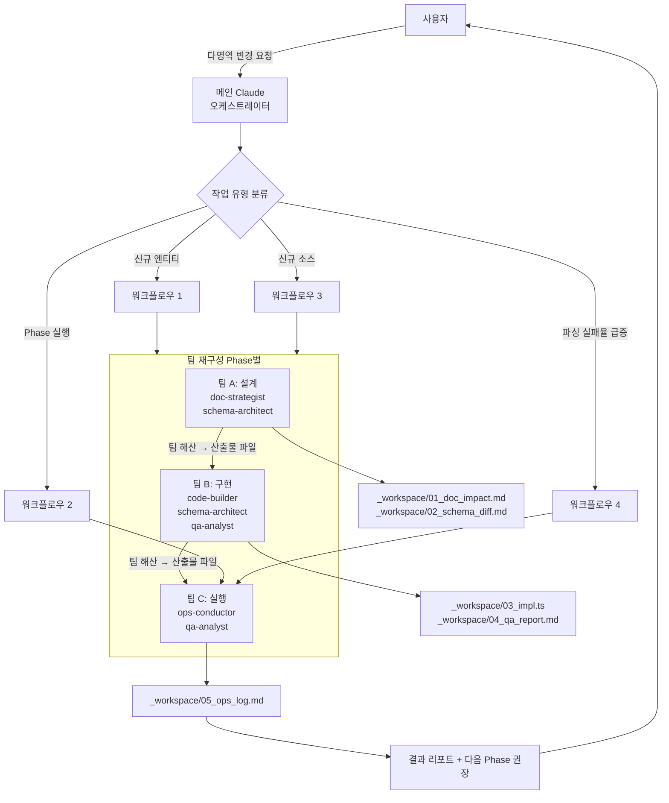

# Pokopia 위키 구축 오케스트레이터

이 스킬은 `pokopia-wiki` 모노레포의 **팀 기반 다중 영역 작업**을 조율한다. 5개 전문 에이전트(`doc-strategist`, `schema-architect`, `code-builder`, `qa-analyst`, `ops-conductor`)를 상황에 맞게 팀으로 구성하고, 작업 순서·데이터 전달·에러 핸들링을 표준화한다.

## 이 스킬을 사용해야 할 때

| 작업 유형 | 예시 |
|----------|------|
| 다영역 변경 | 신규 엔티티 추가(SCHEMA → Prisma → parser → validator → 문서 전부 영향) |
| Phase 실행 | Phase 1~9 중 하나를 실제 크롤링 + QA까지 조율 |
| 신규 소스 도입 | 5번째 소스 추가(fetcher·매핑·문서·ENUM 전부 변경) |
| 대규모 리팩토링 | v2 스키마로 마이그레이션 |
| 장기 운영 이슈 대응 | 파싱 실패율 급증·페르소나 health 하락 근본 원인 분석 |

**사용하지 말아야 할 때:**
- 단일 페이지 파서 오타 수정 → `pokopia-page-parser` 직접 사용
- TECH_STACK.md 오타 수정 → `pokopia-doc-consistency` 직접 사용
- cooldown 상태 확인 → `pokopia-ops-runner` 직접 사용

## 실행 모드

**실행자:** 이 스킬의 오케스트레이터는 전담 리더 에이전트가 아니라 **메인 Claude**가 수행한다. 세션 재개성을 확보하기 위해 중간 산출물을 반드시 `_workspace/`에 기록한다.

**모드 자동 선택 규칙:**

| 조건 | 선택 모드 | 근거 |
|---|---|---|
| `TeamCreate`+`SendMessage`+`TaskCreate` 3개 모두 사용 가능 AND 작업이 교차 의존(예: 신규 엔티티에서 문서↔스키마↔파서 상호 피드백 필요) | **에이전트 팀** | 실시간 조율 이점 |
| 위 3개 중 하나라도 불가 | **서브에이전트 + 파일** | 호환성 우선 |
| 작업이 순수 파이프라인(단계별 산출물 전달만) | **서브에이전트 + 파일** | 단순성 우선 |
| Phase 크롤링 실행처럼 긴 단계적 핸드오프 | **서브에이전트 + 파일** | 재개성 우선 |

**모델 명시:** 모든 `Agent` 호출에 `model: "opus"` 반드시 포함.

## 팀 구성 (작업 유형별)

### 팀 A: 설계/문서 리뷰 팀 (2~3명)

**목적:** 4개 문서 간 정합성 검토, 신규 엔티티/Phase/소스 설계 합의

| 팀원 | 역할 |
|------|------|
| `pokopia-doc-strategist` | 문서 간 경계·참조·수치 정합성 |
| `pokopia-schema-architect` | 스키마 영향 범위 분석 |
| (선택) `pokopia-qa-analyst` | 현재 실측 수치 제공 |

### 팀 B: 구현 팀 (3~4명)

**목적:** 새 기능 구현 (fetcher·parser·mapper·loader)

| 팀원 | 역할 |
|------|------|
| `pokopia-code-builder` | 코드 작성 (리드) |
| `pokopia-schema-architect` | 필요 시 Prisma 스키마 변경 |
| `pokopia-qa-analyst` | 구현 직후 검증 |
| (선택) `pokopia-doc-strategist` | 전략 해석 의문 해결 |

### 팀 C: 실행/QA 팀 (2~3명)

**목적:** Phase 크롤링 실행 + incremental QA

| 팀원 | 역할 |
|------|------|
| `pokopia-ops-conductor` | 드라이런·프로덕션 실행 (리드) |
| `pokopia-qa-analyst` | 완료 직후 incremental QA |
| (선택) `pokopia-code-builder` | 파싱 실패 발생 시 대기 |

### 팀 D: 전체 동원 팀 (5명, 대규모 리팩토링)

모든 에이전트 + 감독자 패턴. 리드는 작업 성격에 따라 다름.

## 팀 크기 원칙

- 5~10 작업 → 2~3명
- 10~20 작업 → 3~5명
- 20+ 작업 → 5명 (최대)

**3명의 집중 > 5명의 산만.** 불필요한 팀원 배정 금지.

## 워크플로우 (작업 유형별 표준)

### 워크플로우 1: 신규 엔티티 도입

```
1. 팀 A 구성: doc-strategist + schema-architect
   ├── doc-strategist: SCHEMA.md에 엔티티 정의 추가 제안
   ├── 정합성 체크 (i18n 필요 여부, polymorphic reward 대상 여부, 감사 컬럼)
   └── DATA_COLLECTION_PLAN Phase 편입 결정
2. 사용자 확인
3. 팀 B 구성: code-builder + schema-architect + qa-analyst
   ├── schema-architect: schema.prisma 갱신 → 마이그레이션
   ├── code-builder: parser + loader 구현
   └── qa-analyst: Zod 스키마 + 교차 참조 검증 로직 추가
4. 팀 C 구성: ops-conductor + qa-analyst
   ├── 드라이런 (--dry-run --source X --limit 5)
   ├── incremental QA → 통과 시 소규모 실행
   └── 최종 Phase 실행
```

### 워크플로우 2: Phase 실행

```
1. 팀 C 구성: ops-conductor + qa-analyst (+ code-builder 대기)
2. Preflight 확인 (cooldown, healthScore, activeHours)
3. 드라이런 (--dry-run --phase N --limit N)
   ├── 실패 시: code-builder 긴급 투입 → 수정 → 재드라이런
   └── 성공 시: 전체 Phase 실행
4. Phase 완료 직후 incremental QA
   ├── 임계 초과 시: ops-conductor 중단 → code-builder 수정
   └── 통과 시: 다음 Phase 준비
5. 결과 리포트 + 다음 Phase 권장
```

### 워크플로우 3: 신규 소스 도입

```
1. 팀 A: doc-strategist + schema-architect
   ├── 소스 티어 결정 (§1.3)
   ├── 매핑 우선순위 결정 (§4.1)
   ├── i18n.source ENUM 확장
   └── TECH_STACK fetcher 표, CRAWLING_STRATEGY §15 추가
2. 팀 B: code-builder + qa-analyst
   ├── 해당 티어 fetcher 구현
   ├── 매퍼 구현
   ├── SOURCE_DEFAULTS에 라이선스 추가
   └── 검증 로직 확장
3. 팀 C: ops-conductor
   ├── Preflight 확장 (새 소스 access 테스트)
   ├── 드라이런
   └── 프로덕션 실행
```

### 워크플로우 4: 크롤링 실행 중 파싱 실패율 급증

```
1. 팀 C: ops-conductor (리드) + qa-analyst + code-builder (긴급 투입)
2. ops-conductor: 서킷 브레이커 활성 → 즉시 중단
3. qa-analyst: data/invalid/ 분석 → 실패 원인 분류 (HTML 변경 vs 네트워크 vs 스키마)
4. code-builder: 원인에 따라
   ├── HTML 변경 → SELECTOR_VERSION bump, 새 파서
   └── 기타 → 근본 원인 수정
5. 팀 D 확장: doc-strategist 투입 → CRAWLING_STRATEGY/SCHEMA 갱신 필요 여부
6. ops-conductor: 드라이런 재실행 → 통과 후 재개
```

## 데이터 전달 프로토콜

### 전략 조합 (권장)

**태스크 기반 + 파일 기반 + 메시지 기반**

- `TaskCreate`/`TaskUpdate`: 작업 상태·의존성
- `_workspace/` 파일: 중간 산출물 (예: `01_analyst_schema_impact.md`)
- `SendMessage`: 실시간 피드백·질문

### 파일 네이밍

```
_workspace/
  {phase}_{agent}_{artifact}.{ext}

예:
  01_doc_strategist_impact_analysis.md
  02_schema_architect_prisma_diff.md
  03_scraper_builder_parser_stub.ts
  04_qa_analyst_validation_report.md
  05_ops_conductor_dry_run_log.md
```

### 최종 산출물 위치

| 유형 | 경로 |
|------|------|
| 문서 변경 | `CRAWLING_STRATEGY.md`, `SCHEMA.md`, `DATA_COLLECTION_PLAN.md`, `TECH_STACK.md` |
| Prisma 스키마 | `prisma/schema.prisma`, `prisma/migrations/` |
| 코드 | `src/` |
| 크롤링 결과 | `data/parsed/`, `data/cache/` |
| QA 리포트 | `data/reports/` |
| Ops 로그 | `data/logs/`, `data/state/` |
| 중간 산출물 | `_workspace/` (감사 추적) |

## 데이터 흐름



> 세션당 1팀만 활성. Phase 간에 팀 해산 후 새 팀 구성. 재개성을 위해 산출물은 반드시 `_workspace/`에 기록.

## 에러 핸들링

### 원칙

1. **1회 재시도 후 재실패 → 결과 없이 진행** (해당 항목 누락 보고서에 명시)
2. **상충 데이터는 삭제하지 않고 출처 병기** (예: 문서 수량 vs 실측 수량)
3. **크리티컬 에러 → 팀 해산, 사용자 확인 대기**

### 에러 유형별 전략

| 에러 | 전략 |
|------|------|
| 에이전트 응답 없음 | 1회 재시도 → 해당 작업 건너뛰고 리포트 |
| 문서 간 충돌 발견 | 자동 수정 X, `doc-strategist`가 리포트 제출, 사용자 결정 |
| Zod 검증 임계 초과 | `ops-conductor` 서킷 브레이커, `code-builder` 수정 대기 |
| 마이그레이션 실패 | 로컬 DB 초기화 재시도, 프로덕션은 절대 --force 금지 |
| 401/403 차단 | 24h cooldown 준수, 페르소나 health 평가 |
| 파싱 실패율 ≥20% | 서킷 브레이커 + 근본 원인 분석 필수 |

## 체크리스트 (오케스트레이터 실행 전)

- [ ] 작업 유형이 이 스킬 대상인지 확인 (단일 영역이면 직접 스킬 사용)
- [ ] 필요한 팀원 선정 (3명의 집중)
- [ ] 실행 모드 결정 (에이전트 팀 권장)
- [ ] 모든 Agent 호출에 `model: "opus"` 명시
- [ ] `_workspace/` 디렉토리 존재 확인
- [ ] 기존 팀 활성 여부 확인 (세션당 1팀만 활성)

## 팀 재구성

같은 세션에서 팀 해체 후 새 팀 구성 가능. Phase 간 전환 시 활용:

```
Phase A (설계): 팀 A 활성 → 산출물을 _workspace/에 저장 → 팀 해산
Phase B (구현): 팀 B 활성 (팀 A 산출물을 파일로 읽어서 작업)
Phase C (QA): 팀 C 활성
```

## 테스트 시나리오

### 시나리오 1 (정상 흐름): 신규 엔티티 `quiz` 추가

```
1. 사용자: "quiz 엔티티 추가 요청 (DATA_COLLECTION_PLAN에 설계만 있음)"
2. 팀 A 활성 (doc-strategist + schema-architect)
   ├── SCHEMA.md에 quiz 스펙 추가
   ├── DATA_COLLECTION_PLAN Phase 5 편입
   └── TECH_STACK 영향 없음 확인
3. 사용자 확인 → 팀 A 해산
4. 팀 B 활성 (code-builder + schema-architect + qa-analyst)
   ├── schema-architect: Prisma 모델 추가, 마이그레이션 생성
   ├── code-builder: parsers/serebii/quiz.ts 작성
   └── qa-analyst: Zod 스키마, 교차 참조 검증 로직
5. 팀 B 해산 → 팀 C 활성 (ops-conductor + qa-analyst)
   ├── 드라이런 (--source serebii --page quiz --limit 5)
   ├── incremental QA 통과
   └── Phase 5 정식 실행
6. 최종 리포트 + 다음 Phase 권장
```

### 시나리오 2 (에러 흐름): namu.wiki 접근 실패 → T3 포기 결정

```
1. 사용자: "Phase 6c 실행"
2. 팀 C 활성 (ops-conductor + qa-analyst)
3. ops-conductor: Preflight → nowsecure.nl 실패
4. 팀 A 긴급 투입 (doc-strategist)
   ├── T3 포기 결정 검토 (§1.3 원칙)
   └── DATA_COLLECTION_PLAN Phase 6d (수동 번역) 준비
5. ops-conductor: Phase 6c 스킵, Phase 6d 수동 번역 리스트 생성
6. 사용자에게 수동 작업 이관 리포트
```

## 공통 인프라 설치

`_workspace/` 디렉토리 및 초기 파일:

```
_workspace/
├── README.md            # 팀 협업 규칙 요약
└── (작업별 산출물)
```

`_workspace/README.md`에 파일 네이밍 컨벤션, 보존 정책(세션 종료 시 최종 산출물만 유지) 명시.

## 실행 예시 (Agent 도구 기반)

```typescript
// 워크플로우 1 (신규 엔티티 도입) 실행
// Step 1: 설계 팀 — 2개 에이전트 병렬 스폰
Agent({
  subagent_type: 'pokopia-doc-strategist',
  model: 'opus',
  description: 'quiz 엔티티 문서 정합성 검토',
  prompt: `신규 엔티티 'quiz'를 DATA_COLLECTION_PLAN과 SCHEMA.md에 추가하는 설계를 리뷰하라.
  결과를 _workspace/01_doc_strategist_quiz_impact.md 에 저장.
  - 엔티티가 어느 Phase에 속하는지
  - i18n 필요 여부, 감사 컬럼, polymorphic reward 대상 여부
  - 수량 추정, 기존 ENUM 확장 필요 여부`,
  run_in_background: true,
})
Agent({
  subagent_type: 'pokopia-schema-architect',
  model: 'opus',
  description: 'quiz Prisma 영향 분석',
  prompt: `신규 엔티티 'quiz' 추가 시 schema.prisma 변경 범위를 분석하라.
  결과를 _workspace/02_schema_architect_quiz_prisma.md 에 저장.`,
  run_in_background: true,
})

// Step 2: 결과 수집 → 사용자 확인 → 구현 팀 스폰
// Step 3: 구현 완료 후 Ops 실행 에이전트 호출
Agent({
  subagent_type: 'pokopia-ops-conductor',
  model: 'opus',
  description: 'quiz 드라이런 및 Phase 실행',
  prompt: `...드라이런 후 QA 결과에 따라 판단...`,
})
```

병렬 가능한 독립 작업은 한 메시지에 복수 `Agent` 호출을 담아 동시 스폰한다.

## 금지 사항

- 단일 에이전트로 해결 가능한 작업에 팀 동원 (오버헤드)
- 세션당 2개 팀 동시 활성화 (불가)
- 에이전트 정의 파일 없이 Agent 도구 prompt에 역할 직접 입력
- `model: "opus"` 생략
- `_workspace/` 없이 메모리 기반 전달만 (재개 불가)
- 긴급 아닌 작업에 "팀 D (5명 전원)" 동원

## 참조

- 에이전트 정의: `.claude/agents/pokopia-*.md`
- 개별 스킬: `.claude/skills/pokopia-*/SKILL.md`
- 프로젝트 문서 SSoT: `CRAWLING_STRATEGY.md`, `SCHEMA.md`, `DATA_COLLECTION_PLAN.md`, `TECH_STACK.md`
- 사용자 선호: `~/.claude/projects/-Users-ukyi-workspace-pokopia-wiki/memory/`
