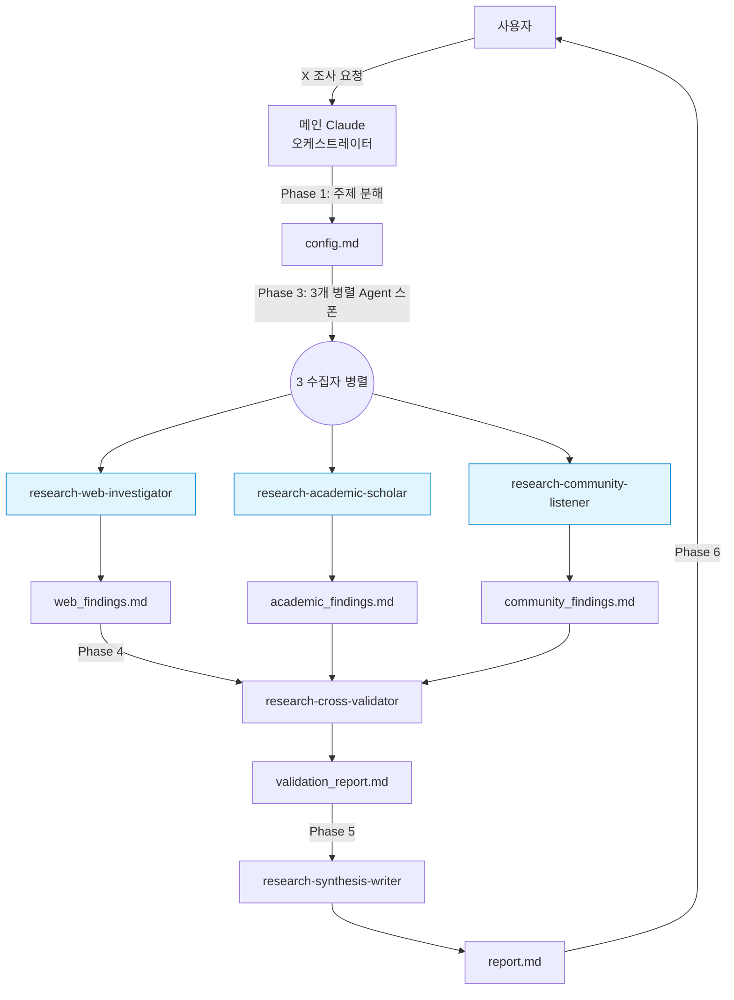

# 리서치 오케스트레이터

이 스킬은 **웹 + 학술 + 커뮤니티** 3방향 조사 → 교차 검증 → 종합 보고서의 표준 리서치 파이프라인을 지휘한다. 5개 에이전트와 5개 수집·검증·작성 스킬이 있다고 가정한다.

## 사용 판단

| 상황 | 이 스킬 사용? |
|------|------------|
| "X가 뭐야?" (한 줄 정의) | ❌ WebSearch 직접 |
| "X에 대해 조사해줘" | ✅ |
| "Y를 여러 소스로 확인해줘" | ✅ |
| "Z에 대한 종합 보고서" | ✅ |
| "A vs B 비교 리서치" | ✅ |
| "논문 찾아줘" (단일) | ❌ WebSearch/학술 단일 쿼리 |
| "최근 뉴스만" | ❌ WebSearch만 |

**경계:** 리서치는 교차 검증이 핵심. 한 각도면 과잉. 두 각도 이상 필요하면 이 스킬.

## 팀 구성

5명 에이전트 (모두 `model: "opus"`):

| 에이전트 | 역할 | 출력 파일 |
|---------|------|---------|
| `research-web-investigator` | 웹 | `web_findings.md` |
| `research-academic-scholar` | 학술 | `academic_findings.md` |
| `research-community-listener` | 커뮤니티 | `community_findings.md` |
| `research-cross-validator` | 교차 검증 | `validation_report.md` |
| `research-synthesis-writer` | 최종 보고서 | `report.md` |

## 실행 모드

**Agent 도구 기반 서브에이전트.** `run_in_background: true`로 3 수집자 병렬 스폰.

(`TeamCreate`/`SendMessage` 사용 가능 환경이면 에이전트 팀 모드로 자연스럽게 확장 가능. 데이터 전달은 파일 기반으로 동일.)

## 표준 워크플로우 (5단계)

### Phase 1: 주제 분해

사용자 요청을 해석:

```
입력: "X에 대해 조사해줘"

오케스트레이터가 도출:
- topic_slug: "kebab-case-slug" (파일 경로용)
- 구체적 질문(들): 1~3개
- 시간 범위: (명시 없으면 "최근 2년" + 역사적 맥락 허용)
- 보고서 길이 모드: 브리핑 / 표준(기본) / 심층
- 독자 프로필: 일반 / 실무자 / 의사결정자 / 연구자 (미지정 시 실무자)
- 특별 관심사: (있으면)
```

사용자에게 확인 필요한 경우:
- 주제가 너무 넓음 → 범위 좁히기 질문
- 특정 관점(찬성/반대/중립 등)이 있는지
- 길이·마감·형식

### Phase 2: 작업 공간 준비

```
_workspace/research/{topic-slug}/
├── config.md          # 주제 분해 결과 저장
├── web_findings.md    # (빈 파일, 수집자가 채움)
├── academic_findings.md
├── community_findings.md
├── validation_report.md  # (검증자가 채움)
└── report.md            # (writer가 채움)
```

`config.md`에 Phase 1 결과 명시해서 에이전트들이 같은 범위를 공유.

### Phase 3: 3 수집자 병렬 스폰

한 메시지에 3개 `Agent` 호출:

```typescript
Agent({
  subagent_type: 'research-web-investigator',
  model: 'opus',
  description: '웹 소스 수집',
  prompt: `주제: "{topic}"
  config: _workspace/research/{topic-slug}/config.md 참조
  출력: _workspace/research/{topic-slug}/web_findings.md
  
  research-web-gathering 스킬의 표준을 따르라.
  시간 범위, 독자, 특별 관심사는 config.md에 명시.
  수집 완료 시 파일 경로 + 주요 발견 5줄 요약으로 응답.`,
  run_in_background: true,
})
Agent({
  subagent_type: 'research-academic-scholar',
  model: 'opus',
  description: '학술 소스 수집',
  prompt: `주제: "{topic}"
  ... (동일 구조, academic_findings.md로)`,
  run_in_background: true,
})
Agent({
  subagent_type: 'research-community-listener',
  model: 'opus',
  description: '커뮤니티 반응 수집',
  prompt: `주제: "{topic}"
  ... (동일 구조, community_findings.md로)`,
  run_in_background: true,
})
```

**독립 수집 원칙:** 3명은 서로 결과를 참조하지 않음. 편향 방지.

### Phase 4: 교차 검증 (순차)

3명 완료 확인 후 cross-validator 1명 스폰:

```typescript
Agent({
  subagent_type: 'research-cross-validator',
  model: 'opus',
  description: '3개 수집 산출물 교차 검증',
  prompt: `다음 3개 파일을 읽고 validation_report.md 작성:
  - _workspace/research/{topic-slug}/web_findings.md
  - _workspace/research/{topic-slug}/academic_findings.md
  - _workspace/research/{topic-slug}/community_findings.md
  
  research-triangulation 스킬의 프레임워크 따르라.
  출력: _workspace/research/{topic-slug}/validation_report.md`,
})
```

**공백이 결정적인 경우:** cross-validator가 "추가 조사 요청" 명시하면 해당 수집자 재스폰 (1회만, 범위 한정).

### Phase 5: 종합 보고서 작성

validation 완료 후 writer 스폰:

```typescript
Agent({
  subagent_type: 'research-synthesis-writer',
  model: 'opus',
  description: '최종 종합 보고서 작성',
  prompt: `validation_report.md와 수집 산출물을 기반으로 종합 보고서 작성.
  
  config.md의 "보고서 길이 모드" 및 "독자 프로필" 반영.
  research-report-composer 스킬의 표준 구조 따르라.
  출력: _workspace/research/{topic-slug}/report.md`,
})
```

### Phase 6: 사용자에게 전달

```
- 최종 보고서 경로: _workspace/research/{topic-slug}/report.md
- Executive Summary (writer의 응답에서)
- 주요 발견 수 + 신뢰도 분포
- 공백/후속 조사 권장
- 전체 산출물 디렉토리 (감사 추적용)
```

사용자가 "요약해서 직접 읽어줘"를 원하면 `report.md`의 Executive Summary + 주요 발견만 chat으로 표시.

## 작업 공간 규칙

```
_workspace/research/{topic-slug}/
├── config.md              # 주제 분해 (오케스트레이터)
├── web_findings.md        # (web-investigator)
├── academic_findings.md   # (academic-scholar)
├── community_findings.md  # (community-listener)
├── validation_report.md   # (cross-validator)
├── report.md              # (synthesis-writer) ← 최종
└── .meta.json             # (선택) 실행 타임스탬프, 에이전트 완료 상태
```

### topic-slug 규칙

- kebab-case, 영문 소문자 + 숫자
- 한글 주제는 영문 번역 or 음차 (예: `ai-ethics`, `ko-election-2027`)
- 최대 40자
- 중복 시 날짜 suffix: `ai-ethics-20260417`

### 산출물 보존

- 중간 파일(`*_findings.md`, `validation_report.md`)은 **보존**. 최종 `report.md` 검증·감사에 사용.
- 세션 종료 시 삭제 금지.
- 사용자가 명시 요청 시만 정리.

## 데이터 흐름



> 독립 수집 원칙: 3 수집자는 서로의 결과를 참조하지 않음 (편향 방지). 파일 기반 전달만 허용.

## 에러 핸들링

| 이벤트 | 대응 |
|--------|------|
| 수집자 1명 실패 (타임아웃/에러) | 해당 파일 빈 상태로 진행, validation이 "해당 소스 공백"으로 처리 |
| 수집자 2명 이상 실패 | 사용자에게 보고, 재시도 or 진행 선택 |
| validation에서 모든 claim 상충 | "현재 합의 없음" 보고서로 진행, writer에게 양가적 기술 지시 |
| validation 누락 | writer 스폰 금지, cross-validator 재실행 |
| 보고서 품질 저하 (신뢰도 A 없음) | writer에게 "결론 유예" 섹션 강화 지시 |
| 사용자가 중단 | 현재까지 산출물을 경로와 함께 보고, 재개 가능하도록 유지 |

## 품질 체크리스트 (종료 전)

- [ ] `_workspace/research/{topic-slug}/` 모든 5개 파일 존재
- [ ] 각 수집 파일에 "공백" 섹션 있음
- [ ] validation_report에 신뢰도 A/B/C/D 등급 부여
- [ ] report.md에 Executive Summary, 주요 발견, 참고문헌 모두 포함
- [ ] 모든 인용 URL + 접근 일자
- [ ] 신뢰도 A 없으면 "결론 유예" 명시
- [ ] 사용자에게 보고서 경로 + 요약 전달

## 테스트 시나리오

### 시나리오 1 (정상): "AI 안전 규제 최근 동향"

```
Phase 1: 주제 분해
  - topic_slug: ai-safety-regulation-2026
  - 질문: "2025~2026 주요 AI 안전 규제 움직임은?"
  - 시간: 2025-01 ~ 2026-04
  - 모드: 표준
  - 독자: 실무자

Phase 2: _workspace/research/ai-safety-regulation-2026/ 준비

Phase 3: 3 수집자 병렬
  - web: EU AI Act, US exec orders, APEC 움직임
  - academic: governance papers, safety benchmarks
  - community: HN·Reddit r/MachineLearning 반응

Phase 4: cross-validator
  - 다중 지지: "EU AI Act 2024 발효" (A)
  - 상충: "AI safety 규제가 혁신 저해" (양론)
  - 공백: "한국 국내 입법 현황" (2차 뉴스만)

Phase 5: writer → report.md

Phase 6: 사용자에게 Exec Summary + 경로 전달
```

### 시나리오 2 (에러 흐름): 커뮤니티 수집자 실패

```
Phase 3에서 community-listener 타임아웃
  → community_findings.md 빈 파일로 남음

Phase 4: cross-validator가 "커뮤니티 소스 공백" 명시로 진행

Phase 5: writer가 여론 섹션을 "데이터 불충분" 처리

Phase 6: 사용자에게 "커뮤니티 소스 수집 실패, 재시도 원하시면 재요청" 알림
```

## 금지 사항

- 3 수집자를 순차 실행 (독립성 손상 우려)
- 수집자가 서로 산출물 참조하도록 프롬프트 작성 (편향)
- cross-validator 건너뛰고 writer 직접 호출
- 주제 범위 미확정 상태로 착수 (Phase 1 필수)
- 파일 기반 전달 우회 (메시지에 전체 내용 inlining 금지)
- `_workspace/` 외부 경로에 산출물 쓰기
- 사용자 질문 밖 주제로 확장

## 참조

- 에이전트: `.claude/agents/research-*.md` (5개)
- 수집 스킬: `research-web-gathering`, `research-academic-sourcing`, `research-community-pulse`
- 검증 스킬: `research-triangulation`
- 작성 스킬: `research-report-composer`
