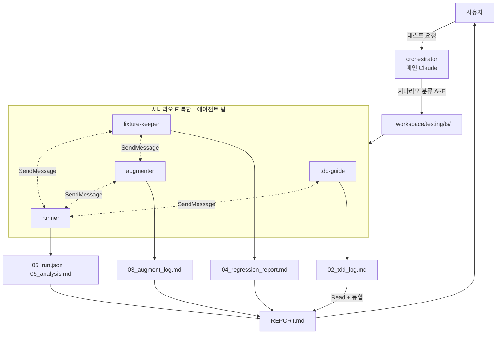

# Testing Orchestrator — 모노레포 테스트 하네스 워크플로우

스크래퍼 + Hono API + Prisma 모노레포의 테스트 작업을 시나리오별로 분류하고, 4명의 전문가를 적절히 동원하여 조율하는 최상위 스킬.

## 실행 모드: 에이전트 팀 (단순 시나리오는 서브 에이전트)

| 시나리오 | 실행 모드 | 이유 |
|---------|----------|------|
| A. 신규 기능 TDD | 서브 에이전트 (tdd-guide → runner 순차) | 2명 순차, 통신 단순 |
| B. 기존 코드 보강 | 서브 에이전트 (augmenter → runner 순차) | 2명 순차 |
| C. 회귀 검증 | 서브 에이전트 (fixture-keeper → runner 순차) | 2명 순차 |
| D. 종합 실행 | 서브 에이전트 (runner 단독) | 1명 |
| **E. 복합** | **에이전트 팀** | 3~4명 협업, SendMessage로 실시간 조율 |

> 4명 모두 동원되는 시나리오 E에서만 TeamCreate. 그 외는 서브 에이전트로 가볍게.

## 에이전트 구성

| 팀원 | subagent_type | 역할 | 주 산출물 |
|------|--------------|------|----------|
| testing-tdd-guide | testing-tdd-guide | RED 작성·사용자 검토 게이트·refactor 권고 | `_workspace/testing/{ts}/02_tdd_log.md` + `*.test.ts` |
| testing-augmenter | testing-augmenter | 엣지·에러 경로 보강 (정상 경로 금지) | `_workspace/testing/{ts}/03_augment_*.md` + `*.edge.test.ts` |
| testing-fixture-keeper | testing-fixture-keeper | fixture 캡처·마스킹·회귀 비교 | `__fixtures__/...` + `_workspace/testing/{ts}/04_*.md` |
| testing-runner | testing-runner | vitest 실행·실패 분류·커버리지 추적 | `_workspace/testing/{ts}/05_run.json` + `05_analysis.md` |

모든 에이전트는 `model: "opus"` 호출.

## 워크플로우

### Phase 1: 시나리오 분류

1. 사용자 입력 분석 → 5개 시나리오 중 매핑
2. 모호하면 1개 질문으로 확정 (강행 금지):
   - "신규 기능을 만들 건가요(TDD), 기존 코드를 보강하나요(augment), 회귀를 잡나요(regression)?"
3. 모노레포 영향 범위 파악:
   - `services/scraper`, `services/api`, `shared`(Prisma), `shared`
   - 한 작업이 여러 패키지에 걸치면 패키지별로 분할

### Phase 2: 작업 디렉토리 준비

```
_workspace/testing/{YYYYMMDDHHmm}/
├── 00_input/             # 사용자 spec, 대상 파일 경로
├── 02_tdd_*              # tdd-guide 산출물
├── 03_augment_*          # augmenter 산출물
├── 04_fixture_*          # fixture-keeper 산출물
├── 05_run.json           # vitest raw
├── 05_analysis.md        # runner 분석
├── 05_coverage_delta.md  # 커버리지 변화
└── REPORT.md             # 최종 통합 리포트
```

### Phase 3: 시나리오별 실행

#### 시나리오 A — 신규 기능 TDD (서브 에이전트)

```
1. Agent(testing-tdd-guide, model: "opus", prompt: spec + 패키지 + 산출물 경로)
   → RED 테스트 작성 + 사용자 검토 게이트
   → 사용자 승인 후 사용자 또는 가이드가 GREEN 구현
2. Agent(testing-runner, model: "opus", prompt: 새 테스트 파일 경로)
   → 실행, 통과 확인, 커버리지 변화 보고
3. Phase 4로
```

#### 시나리오 B — 기존 코드 보강 (서브 에이전트)

```
1. Agent(testing-augmenter, model: "opus", prompt: 대상 파일 + 패키지)
   → 후보 리스트 작성 → 사용자 검토 게이트 → 승인된 케이스만 추가
2. Agent(testing-runner, model: "opus", prompt: 추가된 테스트 경로)
   → 실행, false positive 의심 케이스 보고
3. Phase 4로
```

#### 시나리오 C — 회귀 검증 (서브 에이전트)

```
1. Agent(testing-fixture-keeper, model: "opus", prompt: source 범위 + 비교 모드)
   → live vs fixture 비교 → 회귀 분류 리포트
   → 갱신 필요 시 사용자 승인 게이트
2. Agent(testing-runner, model: "opus", prompt: 회귀 테스트 실행)
   → 실행, 분류 결과 보고
3. Phase 4로
```

#### 시나리오 D — 종합 실행 (서브 에이전트)

```
1. Agent(testing-runner, model: "opus", prompt: 실행 범위 + 옵션)
   → 실행, 분류, 커버리지 보고
2. Phase 4로
```

#### 시나리오 E — 복합 (에이전트 팀)

```
1. TeamCreate(
     team_name: "testing-team",
     members: [
       { name: "tdd-guide",      agent_type: "testing-tdd-guide",      model: "opus", prompt: "..." },
       { name: "augmenter",      agent_type: "testing-augmenter",      model: "opus", prompt: "..." },
       { name: "fixture-keeper", agent_type: "testing-fixture-keeper", model: "opus", prompt: "..." },
       { name: "runner",         agent_type: "testing-runner",         model: "opus", prompt: "..." }
     ]
   )

2. TaskCreate(tasks: [
     { title: "신규 라우트 RED",       assignee: "tdd-guide" },
     { title: "기존 모듈 엣지 보강",   assignee: "augmenter" },
     { title: "fixture 회귀 비교",     assignee: "fixture-keeper" },
     { title: "통합 실행·분류",        assignee: "runner",
       depends_on: ["신규 라우트 RED", "기존 모듈 엣지 보강", "fixture 회귀 비교"] }
   ])

3. 팀원 간 SendMessage 라우트 (리더 거치지 않음):
   - tdd-guide → runner: "RED 테스트 즉시 실행 부탁"
   - augmenter → runner: "보강 테스트 실행"
   - fixture-keeper → runner: "갱신 fixture 회귀 실행"
   - runner → tdd-guide: "RED가 GREEN으로 통과됨, 이상함"
   - runner → augmenter: "부정 케이스 통과, assertion 약함 의심"
   - fixture-keeper → augmenter: "회귀 케이스를 부정 테스트로 승화 가능?"

4. 리더 모니터링: TaskGet으로 진행률, 막힌 팀원에게 SendMessage
```

### Phase 4: 통합 리포트

1. 각 에이전트 산출물을 Read
2. `REPORT.md` 작성 — 다음 구조 강제:

```markdown
# Test Harness Report — {timestamp}

## 시나리오: {A|B|C|D|E}
## 모노레포 범위: {패키지 목록}

## 요약
- 신규 테스트: N개 (TDD: a, augment: b)
- fixture 변경: N건 (selector_drift: a, content_change: b, ...)
- 실행 결과: 통과 X / 실패 Y / flaky Z
- 커버리지 변화: 라인 ±X.X%p, 브랜치 ±X.X%p

## TDD 사이클 (시나리오 A·E)
{02_tdd_log.md 요약}

## 보강 (시나리오 B·E)
{03_augment_log.md 요약}

## 회귀 (시나리오 C·E)
{04_regression_report.md 요약}

## 실행 분석
{05_analysis.md 요약 — 실패 분류별}

## 권장 다음 액션
- {1순위}
- {2순위}
...

## 미완료/실패 영역
- {있다면}
```

### Phase 5: 정리

1. 시나리오 E일 경우 팀 정리 (TeamDelete 또는 종료 메시지)
2. `_workspace/testing/{ts}/` 보존 (감사 추적)
3. 사용자에게 `REPORT.md` 경로와 1~3줄 요약 보고

## 데이터 흐름



> 시나리오 A/B/C/D는 서브 에이전트 순차 실행이므로 에이전트 팀 노드를 단일 에이전트로 축소하여 해석한다.

## 에러 핸들링

| 상황 | 전략 |
|------|------|
| 시나리오 분류 모호 | 1개 질문으로 확정. 임의 분류 금지 |
| 에이전트 1명 실패 | 1회 재시도. 재실패 시 해당 영역 누락 표시하고 진행 |
| 사용자 게이트 거부 (RED 미승인, fixture 갱신 거부) | 해당 단계 중단, REPORT.md에 "사용자 거부" 명시 |
| TDD 사이클 중 GREEN 우선 요청 | 한 번 경고, 이후엔 진행. 리포트에 "TDD 미적용" 표시 |
| vitest 자체 crash | runner에게 환경 분석 위임. orchestrator는 픽스 시도 금지 |
| 회귀 발견 후 자동 갱신 요청 | 거부. 무음 갱신은 검증을 무력화 |
| 모노레포 패키지 충돌 | 패키지별 작업 분할 재등록 |
| 컨텍스트 폭증 (대상 파일 100개+) | 사용자에게 범위 좁히기 제안 |

## 도메인 패턴 참조

| 영역 | 참조 파일 |
|------|----------|
| Hono 통합 테스트 (`app.request()` 활용) | `references/hono-patterns.md` |
| Prisma 트랜잭션 롤백·격리 | `references/prisma-isolation.md` |
| 스크래퍼 fixture·마스킹·라이선스 | `references/scraper-fixture.md` |
| 모노레포 vitest workspace·CI 연동 | `references/integration-guide.md` |

## 테스트 시나리오

### 정상 흐름 (시나리오 E — 복합)

1. 사용자: "services/api에 GET /pokemon/:id 라우트 추가하면서 기존 service 엣지 케이스도 보강하고 회귀까지 봐줘"
2. orchestrator가 시나리오 E로 분류, 모노레포 범위 = `services/api` + `shared`
3. TeamCreate로 4명 팀 구성, 작업 4개 등록
4. tdd-guide가 RED 테스트 작성 → 사용자 검토 → 사용자 구현 (병렬로 augmenter는 service 보강 진행)
5. fixture-keeper가 회귀 비교, drift 1건 발견 → 사용자 갱신 승인
6. runner가 통합 실행, 새 테스트 통과 확인 + 커버리지 +2.3%p
7. orchestrator가 REPORT.md 생성, 팀 정리
8. 예상 결과: `_workspace/testing/{ts}/REPORT.md` + 새 테스트 파일들

### 에러 흐름 (시나리오 A — 사용자 RED 거부)

1. 사용자: "scraper에 새 파서 모듈 추가, TDD로"
2. orchestrator가 시나리오 A로 분류
3. tdd-guide가 RED 테스트 작성, 사용자에게 검토 요청
4. 사용자: "이 테스트로는 spec 다 못 잡음, 다시 짜줘"
5. tdd-guide가 spec 재명확화, 새 RED 작성
6. 다시 거부 → tdd-guide가 사용자에게 spec 자체 재정의 요청
7. 사용자가 진행 중단
8. orchestrator는 `REPORT.md`에 "사용자 중단, RED 미합의" 명시 후 종료
