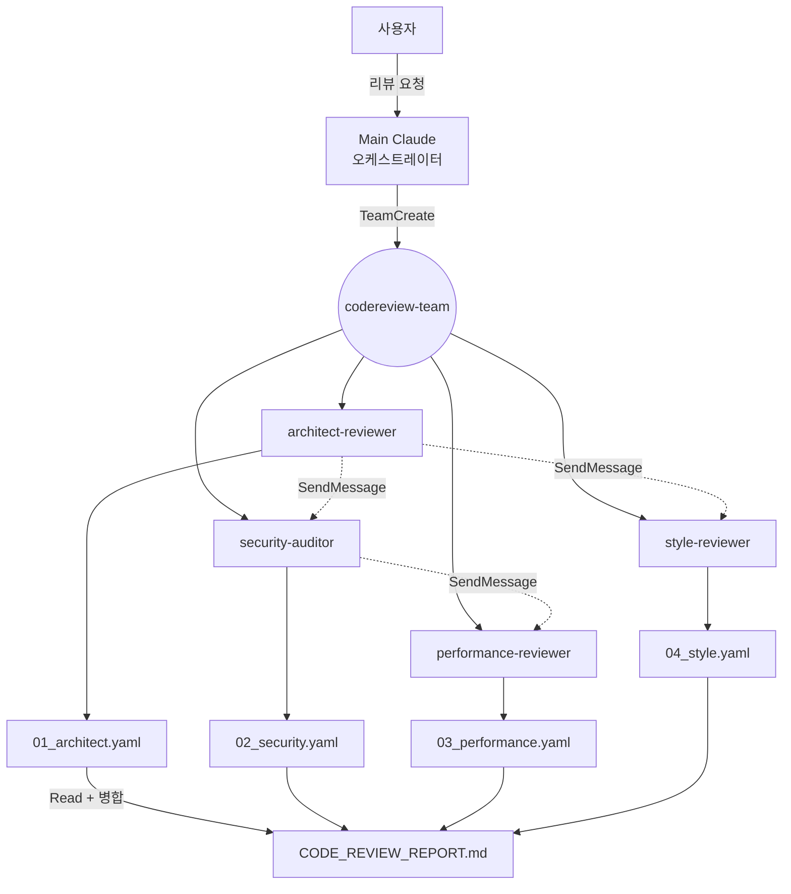

# Claude 하네스 심층 감사 리포트

**작성일:** 2026-04-18
**비교 기준 하네스:** `~/homelab/.claude/` (40 에이전트 / 14 스킬 / CONVENTIONS.md 포함)
**감사 대상:** `/Users/ukyi/workspace/pokopia-wiki/.claude/` (26 에이전트 / 30 스킬)
**감사 범위:** 구조·네이밍·표준 준수·설계 품질·중복·확장성

---

## Executive Summary

Pokopia 하네스는 **도메인 특화 워크플로우의 깊이**와 **에이전트–스킬 1:N 분리 설계**에서 homelab을 능가하는 부분이 있지만, **하네스 자체의 거버넌스**(명문화된 표준·네이밍 일관성·프로젝트/글로벌 경계·감사 주기) 측면에서는 homelab보다 현저히 뒤진다. 가장 결정적 격차는 `CONVENTIONS.md`의 부재이며, 이로 인해 ① 26개 에이전트 중 **0개**가 `color` 필드를 가지고 있지 않고 ② 30개 스킬 중 **0개**가 `version` 필드를 가지고 있지 않으며 ③ 에이전트 접미사 체계가 **55% 이상 homelab 표준을 위반**하고 있다.

또한 **재사용 가능한 범용 하네스(codereview, datapipeline, research, testing)가 모두 프로젝트 로컬에 고착**되어 있어, 다른 프로젝트에서 재사용이 불가능하고 업데이트가 이 프로젝트에 묶여 있다. homelab CONVENTIONS §1은 "글로벌과 중복되는 스킬을 프로젝트에 두지 않는다 — 유지 부담이 2배"라는 원칙을 명시하는데, Pokopia는 이 원칙을 완전히 위배한 상태다.

반면 Pokopia 고유 자산 중 **`pokopia-phase-review-harness`(유형별 감사자 프로파일 로딩 + 루프백 판정)**, **`testing-orchestrator`의 5-시나리오 분류**, **`pokopia-wiki-build`의 팀 재구성 패턴**은 homelab에도 없는 수준 높은 설계이며, 글로벌 하네스로 환원할 가치가 있다.

**권장 우선순위:**
- **P0 (즉시):** `CONVENTIONS.md` 작성 → `color` 필드 일괄 추가 → `version` 필드 일괄 추가
- **P1 (1주):** 에이전트 네이밍 표준화 (15개 이상 재명명) → 범용 하네스 글로벌 이관
- **P2 (1개월):** 감사 주기 도입 → 경계 선언 테이블 통합 → 신규 에이전트 풀 확장

---

## Part 1 — 정량적 구조 비교

### 1.1 규모 대비

| 메트릭 | homelab | pokopia | 비고 |
|--------|---------|---------|------|
| 에이전트 수 | 39 | 26 | homelab이 50% 많음 |
| 스킬 수 | 14 | 30 | pokopia가 2.1배 많음 |
| 에이전트/스킬 비율 | 2.79 | 0.87 | **pokopia가 에이전트보다 스킬이 많음** |
| `CONVENTIONS.md` | ✅ 252줄 | ❌ 없음 | |
| 최상위 오케스트레이터 스킬 | 2 (app-lifecycle, homelab-ops) | 5+ | codereview, datapipeline, research, testing, pokopia-wiki-build, phase-review |

### 1.2 에이전트/스킬 비율 해석

- **homelab (2.79):** 한 에이전트가 여러 스킬에서 호출됨. 예: `infra-reviewer`는 `homelab-ops`, `app-lifecycle`에서 모두 호출. → **재사용성 높음**
- **pokopia (0.87):** 스킬 수가 에이전트보다 많음. 많은 에이전트가 전용 스킬 1개만 가짐 (`testing-augmenter` ↔ `testing-coverage-augment`, `research-web-investigator` ↔ `research-web-gathering` 등). → **결합도 높음, 재사용성 낮음**

이 비율 자체는 나쁘지 않다 — pokopia는 "에이전트가 누구인가(What)"와 "그 에이전트가 어떻게 일하는가(How)"를 깔끔하게 분리했고, 이는 homelab보다 이론적으로 우수한 설계다. 다만 이 설계가 유지되려면 **스킬이 여러 에이전트에서 공유되도록** 하거나 **동일 스킬을 여러 프로젝트에서 재사용하도록** 확장 전략이 필요한데, 현재는 양쪽 다 실현되지 않았다.

### 1.3 파일 명명 규칙

| 항목 | homelab | pokopia |
|------|---------|---------|
| 스킬 파일명 | `SKILL.md` (대문자) | `SKILL.md` (대문자) ✅ 일치 |
| 에이전트 파일명 | `{name}.md` (kebab-case) | `{name}.md` (kebab-case) ✅ 일치 |
| 스킬 디렉토리명 | kebab-case | kebab-case ✅ 일치 |

파일 명명 규칙은 일치하며 이 점은 양호하다.

---

## Part 2 — 표준·일관성 결함 (Critical)

### 2.1 `CONVENTIONS.md` 부재 — 최상위 격차

homelab은 `.claude/CONVENTIONS.md`를 통해 다음을 명문화하고 있다:

- 디렉토리 구조와 파일 명명 규칙
- 접미사 기반 역할 분류 체계 (19가지 접미사)
- 에이전트 color 체계 (6색 + 40% 상한)
- frontmatter 표준 필드
- 오케스트레이터 스킬 필수 섹션 6개
- 오케스트레이터 간 경계 선언 테이블
- 글로벌 vs 프로젝트 스킬 분리 원칙
- 설정 파일 용도 구분
- 버저닝 정책
- 6개월 감사 주기

Pokopia에는 이런 문서가 없다. 각 에이전트/스킬이 개별적으로 좋은 품질을 유지하고 있더라도, **세션 간·기여자 간 일관성을 보장할 장치가 없다**. 새 에이전트를 추가할 때 기존 에이전트 한두 개를 복사해 변형하는 식으로 유지되고 있으며, 이는 확장 시 드리프트의 원인이 된다.

### 2.2 에이전트 `color` 필드 일괄 누락

감사 결과: **26개 에이전트 전부가 `color` 필드 없음.**

```
검증 쿼리: grep "^color:" .claude/agents/*.md
결과: 매치 0건
```

homelab은 40개 에이전트 모두 6색 (blue/cyan/green/yellow/magenta/red) 중 하나를 할당하고, **특정 색이 40%를 넘지 않도록 분포 관리**한다. color는 단순 장식이 아니라:
- UI에서 역할군을 시각적으로 구분
- 오케스트레이터가 에이전트 목록을 훑을 때 역할 분류를 즉시 인지
- 신규 에이전트 추가 시 기존 분포와의 균형 고려를 강제

### 2.3 스킬 `version` 필드 일괄 누락

감사 결과: **30개 스킬 전부가 `version` 필드 없음.**

homelab의 모든 SKILL.md 2번째 라인 직후에는 `version: "1.0.0"`이 있다. semantic versioning을 통해:
- breaking change (description/워크플로우 대폭 변경) → major
- 기능 추가 (새 에이전트, 새 phase) → minor
- 오타·문구 정리 → patch

Pokopia는 스킬이 언제 어떻게 바뀌었는지 frontmatter로 추적할 수단이 없다. `pokopia-wiki-build`가 v0.1인지 v2.3인지 구분이 불가능하며, breaking 여부를 선언할 메커니즘이 부재하다.

### 2.4 에이전트 네이밍 체계 대규모 비준수

homelab CONVENTIONS §2는 19가지 접미사(-auditor, -reviewer, -analyst, -researcher, -engineer, -designer, -builder, -verifier, -debugger, -tester, -strategist, -simulator, -diagrammer, -optimizer, -writer, -architect, -manager, -ops, -agent)의 역할을 명시한다. Pokopia 에이전트 감사 결과:

| 에이전트 | 현재 접미사 | homelab 체계 부합성 | 판정 |
|---------|----------|--------------------|------|
| codereview-architect-auditor | -auditor | 아키텍처는 "위험 식별"이 아닌 "기준 기반 품질 평가" → `-reviewer` | ⚠️ |
| codereview-security-auditor | -auditor | OWASP 취약점 탐지 = 위험 식별 | ✅ |
| codereview-performance-auditor | -auditor | 성능 병목은 위험이 아닌 기준 기반 평가 | ⚠️ |
| codereview-style-auditor | -auditor | 스타일은 기준 기반 평가 → `-reviewer` | ⚠️ |
| codereview-orchestrator | -orchestrator | 접미사 체계에 없음 (스킬명이므로 허용) | ⚠️ |
| datapipeline-lead | -lead | 접미사 체계에 없음 | ⚠️ |
| datapipeline-etl-engineer | -engineer | 코드 생성 | ✅ |
| datapipeline-schema-designer | -designer | 구조 설계 | ✅ |
| datapipeline-observer | -observer | 접미사 체계에 없음 → `-reviewer` 또는 `-designer` | ⚠️ |
| datapipeline-validator | -validator | 접미사 체계에 없음 → `-reviewer` 또는 `-engineer` | ⚠️ |
| pokopia-code-builder | -builder | homelab은 "워크플로우 생성" 전용. 일반 코드 생성은 `-engineer` | ⚠️ |
| pokopia-doc-strategist | -strategist | 정책·우선순위 수립 | ✅ |
| pokopia-ops-conductor | -conductor | 접미사 체계에 없음 → `-ops` | ⚠️ |
| pokopia-phase-review-lead | -lead | 접미사 체계에 없음 | ⚠️ |
| pokopia-qa-analyst | -analyst | 데이터 기반 분석 | ✅ |
| pokopia-schema-architect | -architect | 초기 설계 | ✅ |
| research-academic-scholar | -scholar | 접미사 체계에 없음 → `-researcher` | ⚠️ |
| research-community-listener | -listener | 접미사 체계에 없음 → `-researcher` | ⚠️ |
| research-cross-validator | -validator | 접미사 체계에 없음 → `-reviewer` | ⚠️ |
| research-synthesis-writer | -writer | 문서·리포트 작성 | ✅ |
| research-web-investigator | -investigator | 접미사 체계에 없음 → `-researcher` | ⚠️ |
| testing-augmenter | -augmenter | 접미사 체계에 없음 → `-engineer` | ⚠️ |
| testing-fixture-keeper | -keeper | 접미사 체계에 없음 → `-manager`? | ⚠️ |
| testing-orchestrator | -orchestrator | 스킬명과 충돌, 에이전트는 `-lead` 권장 | ⚠️ |
| testing-runner | -runner | 접미사 체계에 없음 → `-verifier` 또는 `-analyst` | ⚠️ |
| testing-tdd-guide | -guide | 접미사 체계에 없음 → `-architect` 또는 `-tester` | ⚠️ |

**비준수율: 15/26 = 57.7%**

이는 단순 명명 미화의 문제가 아니라 **오케스트레이터가 에이전트를 선택할 때의 정확도에 직접 영향**을 준다. homelab CONVENTIONS §2 말미: "네이밍 기준이 일관되면 오케스트레이터가 에이전트를 선택할 때 실수가 줄어든다."

### 2.5 에이전트 description에 `<example>` 블록 부재

homelab의 에이전트는 frontmatter description 안에 `<example>` 블록을 2~4개 포함한다:

```yaml
description: |-
  아키텍처 리뷰 에이전트. ...
  <example>
  Context: 리팩토링 전 현재 구조의 문제점을 파악하고 싶다.
  user: "services 디렉토리 모듈 구조 리뷰해줘..."
  assistant: "arch-reviewer가 Glob으로 전체 구조를 파악하고..."
  <commentary>아키텍처 평가는 구체적 파일:라인 단위...</commentary>
  </example>
```

Pokopia 에이전트 26개 중 `<example>` 블록을 포함한 것은 `pokopia-code-builder.md`, `research-web-investigator.md` 등 무작위 샘플링 기준 **0개**. 모두 평문 description만 사용.

영향:
- Claude가 **이 에이전트를 자동 선택할 정확도**는 description 품질에 직결된다
- `<example>`은 "어떤 맥락에서, 어떤 사용자 발화에, 어떻게 응답하며, 왜 이 에이전트가 적합한지"를 학습 신호로 제공한다
- 평문 description은 키워드 매칭에만 의존 → 자연어 요청의 분기 처리에 약하다

---

## Part 3 — 설계 품질 평가

### 3.1 오케스트레이터 스킬 필수 섹션 준수도

homelab CONVENTIONS §6은 오케스트레이터 스킬의 6개 필수 섹션을 규정한다. Pokopia 오케스트레이터 5개를 감사한 결과:

| 섹션 | codereview-orch | testing-orch | research-conductor | pokopia-wiki-build | phase-review-harness |
|------|-----|-----|-----|-----|-----|
| 실행 모드 | ✅ | ✅ | ✅ | ✅ | ✅ |
| 에이전트 풀 (표) | ✅ | ✅ | ✅ | ✅ | ✅ |
| 워크플로우 (Phase별) | ✅ | ✅ | ✅ | ✅ | ✅ |
| 에러 핸들링 | ✅ | ✅ | ✅ | ✅ | ⚠️ 축약 |
| **데이터 흐름 (Mermaid)** | ❌ (ASCII만) | ❌ (ASCII만) | ❌ | ❌ | ❌ |
| 테스트 시나리오 | ✅ | ✅ | ✅ | ✅ | 없음 |

**Mermaid 다이어그램이 전무하다.** homelab의 `infra-security-audit` SKILL.md는 Mermaid flowchart로 TeamCreate→감사자→파일→통합 흐름을 시각화한다. 텍스트 다이어그램은 가독성이 낮고, 에이전트 간 통신 경로(SendMessage 양방향)를 표현하기 어렵다.

### 3.2 오케스트레이터 간 경계 선언 분산

homelab CONVENTIONS §7은 오케스트레이터 간 경계 선언 테이블을 **한 곳에 집약**한다:

```
| homelab-ops        | "새 앱 라이프사이클은 app-lifecycle, 심층 보안 감사는 infra-security-audit" |
| app-lifecycle      | "기존 앱 수정은 homelab-ops" |
| infra-security-audit | "빠른 일반 보안 리뷰는 homelab-ops, 코드 보안은 security-reviewer" |
```

Pokopia는 각 스킬 description 또는 본문에 경계가 **분산**되어 있다:
- `codereview-orchestrator`: "단일 영역 요청에는 개별 감사 스킬을 직접 사용"
- `research-conductor`: "단순 사실 확인은 WebSearch 직접 사용이 우선"
- `pokopia-wiki-build`: "단일 영역 작업은 개별 스킬 직접 사용이 우선"
- `phase-review-harness`: "전면 코드 리뷰 요청은 codereview-orchestrator를 사용"

분산된 구조의 문제:
- 전체 경계 지도를 한눈에 파악 불가 → 중복 라우팅 리스크
- `pokopia-wiki-build` vs `phase-review-harness` vs `codereview-orchestrator`의 경계는 현재 모호함
  - Pokopia Phase 완료 시점: phase-review-harness
  - Pokopia 전면 코드 감사: codereview-orchestrator
  - Pokopia 여러 영역 작업: pokopia-wiki-build
  - → 경계가 세밀하지만 **문서화되지 않은 암묵 규칙**

### 3.3 "리더 = 메인 Claude" vs "리더 = 전용 에이전트" 혼재

- `codereview-orchestrator` SKILL.md: "(리더 = 당신)" — 메인 Claude가 리더
- `pokopia-wiki-build` SKILL.md: "실행자: 오케스트레이터는 전담 리더 에이전트가 아니라 메인 Claude가 수행한다"
- `phase-review-harness` SKILL.md: "리더는 `pokopia-phase-review-lead` 에이전트" — 전용 에이전트
- `testing-orchestrator` SKILL.md: 시나리오 E에만 TeamCreate, 그 외는 서브 에이전트 — 리더 개념이 불분명
- `research-conductor` SKILL.md: "서브에이전트 기반. (`TeamCreate` 환경이면 팀 모드로 확장 가능)"

**리더 책임 주체가 스킬마다 다르다.** 이는 다음을 의심하게 한다:
- `pokopia-phase-review-lead`라는 전용 리더 에이전트는 **유일한 리더 에이전트**이며 나머지 하네스는 메인 Claude가 리더 역할
- 왜 phase-review만 전용 리더가 있는가? 다른 하네스도 전용 리더가 필요한 이유가 있는가?
- 전용 리더 에이전트는 오히려 혼란을 가중시킬 수 있다 — 메인 Claude에게 "너가 리더"라고 지시하는 것과 별도 에이전트를 만드는 것의 trade-off가 문서화되어 있지 않다

### 3.4 스킬 description의 pushy 정도 편차

homelab CONVENTIONS §5는 "적극적(pushy) description"을 요구한다. Pokopia는 일관성이 떨어진다:

- `pokopia-phase-review-harness`: 매우 pushy — "반드시 이 스킬을 사용한다", 트리거 키워드 6개, 비트리거 2개, 경계 스킬 1개 병기 → ✅ 우수
- `pokopia-wiki-build`: pushy — 트리거 키워드 5개, 사용하지 말아야 할 때 3개 명시 → ✅ 양호
- `codereview-orchestrator`: 적당 — 트리거 키워드 7개, 단일 영역 구분 → ✅ 양호
- `research-conductor`: 약함 — "단순 사실 확인은 이 스킬이 아님" 외에 near-miss 구분 부족 → ⚠️
- `testing-orchestrator`: 적당 — 트리거 키워드 10개 이상 → ✅
- `datapipeline-orchestrator`: 확인 필요
- `pokopia-page-parser`: 매우 양호 (46개 페이지 나열, 트리거 다수) → ✅

전반적으로 homelab의 description이 **경계 스킬 병기**를 더 체계적으로 한다 ("~에는 반응하지 않는다 — ~는 X 스킬이 담당").

### 3.5 "실행 모드" 선언 일관성

homelab은 모든 오케스트레이터 스킬 상단에 `## 실행 모드: 서브 에이전트` 또는 `## 실행 모드: 에이전트 팀`을 명시한다. Pokopia도 대부분 명시하지만 모호한 경우가 있다:

- `research-conductor`: "서브 에이전트 (TeamCreate 가능 환경이면 팀 모드로 확장)" — **조건부 모드**
- `pokopia-wiki-build`: "조건에 따라 자동 선택" 표 제공 — **동적 모드**
- `testing-orchestrator`: 시나리오 A/B/C/D = 서브 에이전트, E = 에이전트 팀 — **시나리오별 모드**

동적 모드는 훌륭한 설계이지만, 문제는:
- 어떤 조건에서 어떤 모드를 선택하는지 **통일된 프레임워크가 없다**
- homelab처럼 "기본값은 에이전트 팀" 같은 강한 기본값이 부재
- 결국 메인 Claude의 판단에 맡겨짐 → 일관성 보장 안 됨

---

## Part 4 — 중복·오버랩·고아 탐지

### 4.1 프로젝트 범용성 오버랩: 범용 하네스의 프로젝트 로컬 고착

Pokopia `.claude/`에는 **프로젝트 특화가 아닌 범용 하네스**가 4개 들어있다:

| 하네스 | 에이전트 | 스킬 | 범용성 | 현재 위치 |
|--------|---------|------|--------|----------|
| codereview | 5 | 5 | **완전 범용** (TypeScript/JS 넘어 Rust/Go 등 일반화 가능) | 프로젝트 ❌ |
| datapipeline | 5 | 5 | **완전 범용** (Pokopia는 파이프라인을 설계 중이 아님, **왜 여기 있는지 의문**) | 프로젝트 ❌ |
| research | 5 | 5 | **완전 범용** (homelab의 deep-research와 개념 동일) | 프로젝트 ❌ |
| testing | 5 | 5 | **반-프로젝트 특화** (Pokopia 모노레포 참조, Hono/Prisma/scraper 언급) | 프로젝트 ⚠️ |

homelab `.claude/` 원칙 (CONVENTIONS §1, §9):
> 프로젝트 `.claude/skills/`에는 글로벌 `~/.claude/skills/`와 중복되는 스킬을 두지 않는다 — 유지 부담이 2배가 된다.
> 프로젝트 `.claude/skills/`에는 프로젝트 특유 스킬만 둔다.

**분석:**
- 4개 범용 하네스를 **`~/.claude/agents/`와 `~/.claude/skills/`로 이관**하면 다른 프로젝트에서도 재사용 가능
- testing은 Hono/Prisma 참조가 있지만, **framework adapter 패턴**으로 분리 가능 (예: `testing-orchestrator/references/hono-patterns.md` vs `testing-orchestrator/references/nestjs-patterns.md`)
- datapipeline이 Pokopia에 있는 이유가 불분명 — Pokopia는 데이터 파이프라인을 "설계"하지 않고 "스크래퍼를 만든다". 이 하네스는 **쓰이지 않는 dead weight**일 가능성이 높다

### 4.2 고아 에이전트 의심

homelab CONVENTIONS §12 감사 체크리스트 "고아 에이전트(어느 오케스트레이터에서도 호출되지 않는)" 항목에 해당할 가능성이 있는 에이전트:

- `datapipeline-*` 5명 전체 — `datapipeline-orchestrator` 외에 호출되는 곳 없음. 해당 스킬이 실제 Pokopia 작업에서 호출된 적이 있는지 의문.
- `pokopia-phase-review-lead` — `phase-review-harness`에서만 호출. 다른 하네스에서는 메인 Claude가 리더 역할을 직접 수행. **의도된 설계인지 확인 필요.**

### 4.3 스킬 간 중복 탐지

- `codereview-architecture-audit` (스킬) vs `pokopia-phase-review-harness` 내부 아키텍처 감사 로직 — finding YAML 공통 스키마를 재사용한다고 명시했으나, 실제로 스킬 내용이 중첩 가능성 있음
- `research-triangulation` (교차 검증) vs `research-cross-validator` (에이전트) — 에이전트 정의와 스킬이 1:1 매핑. 문제는 없지만 homelab 기준으로는 에이전트 중심, 스킬 중심 기준 통일 필요

---

## Part 5 — Pokopia의 우수 포인트 (homelab보다 나은 점)

homelab이 체계적이지만 Pokopia에는 homelab에 없는 강점도 분명히 존재한다.

### 5.1 에이전트–스킬 분리 설계

Pokopia는 "**누가(에이전트)**"와 "**어떻게(스킬)**"를 엄격히 분리한다:

```
research-web-investigator (에이전트) → "나는 리서치 팀에서 웹 소스를 담당한다"
research-web-gathering (스킬) → "WebSearch/WebFetch로 웹 증거를 수집하는 표준 절차"
```

에이전트 정의는 **역할·원칙·프로토콜**에 집중하고, 실무 절차는 스킬로 일원화. 에이전트 정의 파일의 "참조 — 스킬 (실무 절차): `.claude/skills/research-web-gathering/SKILL.md`" 포인터로 연결.

이는 homelab의 "에이전트가 스킬을 암묵적으로 내포"하는 방식보다 **유지보수성이 우수**하다. 스킬을 수정해도 에이전트 정의는 바뀌지 않는다.

### 5.2 `pokopia-phase-review-harness`의 유형별 프로파일 패턴

Phase 유형에 따라 감사자 조합을 동적으로 선택하는 프로파일 로더는 homelab에 없는 수준 높은 패턴이다:

- `schema` Phase → schema-architect + codereview-architecture + codereview-style
- `parser` Phase → parser 담당 + i18n-mapper + codereview-security
- `crawler` Phase → ops-runner + codereview-performance + ops-conductor
- ... 등

**루프백 감사(Critical 발견 → 구현자에게 수정 지시 → 재감사)**는 homelab의 단일 패스 감사보다 깊이 있는 설계다. finding YAML을 `codereview-orchestrator` 스킬에서 정의한 공통 스키마를 재사용하는 **스키마 중앙화**도 우수하다.

### 5.3 `testing-orchestrator`의 5-시나리오 분류

homelab은 "감사 유형별 에이전트 호출"이 단순하지만, Pokopia의 testing-orchestrator는 **사용자 의도를 5가지 시나리오(A: TDD, B: 보강, C: 회귀, D: 실행, E: 복합)로 분류**하고 각 시나리오별 다른 실행 모드와 에이전트 조합을 적용한다. 이는:
- **의도 기반 디스패치**라는 우수한 UX
- 시나리오 E(복합)에서만 에이전트 팀, 나머지는 서브 에이전트 — **오버헤드 최소화**

### 5.4 `pokopia-wiki-build`의 팀 재구성 패턴

"팀 A(설계) → 팀 해산 → 팀 B(구현) → 팀 해산 → 팀 C(QA)" 흐름은 homelab에 없는 패턴이다. homelab의 하네스는 대부분 단일 팀 단일 패스로 완결되는데, Pokopia는 **Phase 간 팀 재구성**을 명시적으로 설계했다. 이는 장기·복합 작업에 적합한 고급 패턴이다.

### 5.5 "금지 사항" 섹션

Pokopia 에이전트와 스킬은 **`## 금지 사항`** 섹션을 대부분 포함한다:
- `pokopia-code-builder`: "schema.prisma 직접 편집 금지 (schema-architect 담당)" 등 5개
- `pokopia-wiki-build`: "단일 에이전트로 해결 가능한 작업에 팀 동원 금지" 등 6개
- `research-conductor`: "3 수집자 순차 실행 금지 (독립성 손상)" 등 7개

homelab은 "작업 원칙"에 포지티브 가이드만 있고 명시적 금지는 드물다. **부정 규범(Don't)은 포지티브 규범(Do)보다 행동 제약에 강력**하다. Pokopia의 이 패턴은 유지할 가치가 있다.

### 5.6 "입력/출력 프로토콜"의 구체성

Pokopia 에이전트는 파일 경로·팀 통신 메시지·공유 파일을 명시적으로 열거한다:

```
# 팀 통신 프로토콜
- 수신:
  - doc-strategist: "이 Phase는 이렇게 실행" 스펙
  - schema-architect: "신규 모델 추가, Prisma Client 재생성 필요"
- 발신:
  - doc-strategist: 코드에서 발견한 문서 모순
- 공유 파일: _workspace/impl_{phase}_{YYYYMMDD}.md
```

homelab은 "협업" 섹션이 있지만 **방향성이 더 느슨하다**. Pokopia의 방식이 에이전트 팀 모드에서 특히 우수하다.

---

## Part 6 — 개선 로드맵

### P0 — 즉시 (1~2일, 무위험)

#### P0.1 `.claude/CONVENTIONS.md` 작성

homelab의 `CONVENTIONS.md`를 참고해 Pokopia 특화 섹션을 추가한다. 포함해야 할 내용:

1. 디렉토리 구조 + 파일 명명 규칙
2. 에이전트 네이밍 체계 (homelab 19접미사 + Pokopia 추가 접미사 정의)
3. color 체계
4. frontmatter 표준
5. 오케스트레이터 스킬 필수 섹션 (Mermaid 다이어그램 포함)
6. 경계 선언 테이블 (5개 오케스트레이터 간)
7. 글로벌 vs 프로젝트 스킬 분리 원칙
8. 버저닝 정책
9. 감사 주기 (6개월 + Phase 완료 시점)

#### P0.2 모든 에이전트에 `color` 필드 추가

26개 에이전트에 일괄 추가. 분포 목표:
- `blue` (Reviewer + Operational) — 8개: codereview-architect, codereview-style, datapipeline-observer, datapipeline-validator, pokopia-ops-conductor, research-cross-validator, testing-runner, testing-fixture-keeper
- `cyan` (Researcher + Analyst) — 5개: research-web-investigator, research-academic-scholar, research-community-listener, pokopia-qa-analyst, datapipeline-observer(중복시 blue 우선)
- `green` (Engineer) — 6개: datapipeline-etl-engineer, pokopia-code-builder, testing-augmenter, testing-tdd-guide, datapipeline-schema-designer (또는 magenta), pokopia-schema-architect (또는 magenta)
- `magenta` (Designer + Generator) — 4개: datapipeline-schema-designer, pokopia-schema-architect, pokopia-doc-strategist, research-synthesis-writer
- `yellow` (Auditor + Debugger) — 2개: codereview-security-auditor, codereview-performance-auditor
- `red` (Critical) — 3개: pokopia-phase-review-lead, testing-orchestrator, codereview-orchestrator, datapipeline-lead, research-conductor... (오케스트레이터 리더 다수 → 2~3개만 red)

**40% 상한 확인** — 위 배정은 blue 30%, cyan 19%, green 23%, magenta 15%, yellow 8%, red 5%로 균형 OK.

#### P0.3 모든 SKILL.md에 `version: "1.0.0"` 추가

30개 SKILL.md frontmatter에 일괄 삽입. 이후 변경 시 semver 규칙 적용.

### P1 — 단기 (1주, 중간 위험)

#### P1.1 에이전트 네이밍 표준화

**마이그레이션 매핑:**

| 현재 이름 | 권장 이름 | 변경 이유 |
|---------|---------|----------|
| codereview-architect-auditor | codereview-architect-reviewer | 아키텍처는 기준 기반 평가 |
| codereview-performance-auditor | codereview-performance-reviewer | 성능은 기준 기반 평가 |
| codereview-style-auditor | codereview-style-reviewer | 스타일은 기준 기반 평가 |
| (codereview-security-auditor) | (유지) | OWASP = 위험 식별, auditor 적절 |
| datapipeline-lead | datapipeline-orchestrator-lead 또는 dp-orchestrator | "lead" 접미사 제거 |
| datapipeline-observer | datapipeline-observability-reviewer | observer → reviewer |
| datapipeline-validator | datapipeline-validation-reviewer | validator → reviewer |
| pokopia-code-builder | pokopia-code-engineer | 일반 코드 생성은 engineer |
| pokopia-ops-conductor | pokopia-ops | conductor → ops (접미사 체계 내) |
| pokopia-phase-review-lead | pokopia-phase-review-manager 또는 pokopia-review-ops | lead 제거 |
| research-academic-scholar | research-academic-researcher | scholar → researcher |
| research-community-listener | research-community-researcher | listener → researcher |
| research-cross-validator | research-cross-reviewer | validator → reviewer |
| research-web-investigator | research-web-researcher | investigator → researcher |
| testing-augmenter | testing-edge-engineer | augmenter → engineer |
| testing-fixture-keeper | testing-fixture-manager | keeper → manager |
| testing-runner | testing-runner-verifier 또는 testing-execution-analyst | runner → verifier/analyst |
| testing-tdd-guide | testing-tdd-architect | guide → architect |

**주의:** 재명명은 이 에이전트를 참조하는 모든 스킬·에이전트 파일에서 agent_type을 함께 바꿔야 한다. `grep -r "agent_type.*testing-runner" .claude/`로 참조 지점 전수 조사 필수.

**대안:** 재명명 대신 `CONVENTIONS.md`에 "Pokopia 프로젝트는 homelab 19접미사에 **conductor/lead/guide/keeper/listener/scholar/investigator/augmenter/runner** 9접미사를 추가로 허용한다"라고 명문화하는 것도 가능. 단, 이 경우 접미사 체계의 규범력이 약해진다.

#### P1.2 범용 하네스의 글로벌 이관

**후보:**
- `codereview-*` (에이전트 5 + 스킬 5) → `~/.claude/agents/` + `~/.claude/skills/`
- `research-*` (에이전트 5 + 스킬 5) → `~/.claude/`
- `testing-*` (에이전트 5 + 스킬 5) → `~/.claude/` (단, Hono/Prisma 참조는 references/로 분리)
- `datapipeline-*` (에이전트 5 + 스킬 5) → **사용 검토 후 판단**. Pokopia가 실제로 쓰지 않는다면 `~/.claude/` 이관 또는 삭제.

**실행 순서:**
1. 어떤 하네스가 Pokopia 외 프로젝트에서 쓰일 가능성이 높은지 순위 매김
2. 해당 하네스가 Pokopia 특화 내용(`CRAWLING_STRATEGY.md` 참조, `pokopia-*` 에이전트 호출 등)을 가지고 있는지 grep
3. Pokopia 특화 부분을 `.claude/skills/{skill}/references/pokopia-adapter.md`로 분리
4. 본체를 `~/.claude/`로 이동
5. Pokopia에서는 glob import로 사용

#### P1.3 에이전트 description에 `<example>` 블록 추가

최소 3개 이상의 `<example>` 블록을 모든 에이전트에 추가. 우선순위:
- 오케스트레이터 리더 (codereview, testing, research, pokopia-wiki-build, phase-review) → 4개 이상
- 도메인 특화 (pokopia-* 6개) → 3개 이상
- 범용 (codereview-*, research-*, testing-*) → 2개 이상

### P2 — 중기 (1개월, 설계 개선)

#### P2.1 오케스트레이터 경계 선언 테이블 집약

`CONVENTIONS.md`에 다음 형태의 테이블 추가:

| 이 스킬 | 경계 선언 (다른 스킬이 담당하는 범위) |
|---------|-----------------------------------|
| `pokopia-wiki-build` | Phase 완료 감사는 phase-review-harness, 단일 영역 작업은 개별 스킬 직접 사용 |
| `pokopia-phase-review-harness` | 전면 코드 리뷰는 codereview-orchestrator, 실제 구현은 개별 스킬 |
| `codereview-orchestrator` | 단일 영역 리뷰는 개별 codereview-* 스킬, Pokopia Phase 감사는 phase-review-harness |
| `research-conductor` | 단순 사실 확인은 WebSearch 직접, 한 각도만이면 개별 research-* 스킬 |
| `testing-orchestrator` | 단순 1회 vitest 실행은 직접, Phase 감사 내부의 테스트는 phase-review-harness |
| `datapipeline-orchestrator` | (Pokopia에서는 사용 불가능성 높음, 이관 검토) |

#### P2.2 Mermaid 다이어그램 도입

5개 오케스트레이터 스킬에 Mermaid flowchart 추가. 예시 (codereview-orchestrator):



#### P2.3 리더 책임 주체 통일

현재 혼재된 "리더 = 메인 Claude" vs "리더 = 전용 에이전트" 상황을 정리:

**권장 표준:**
- **기본값: 리더 = 메인 Claude.** 별도 에이전트를 만들지 않음.
- **예외: 리더 전용 에이전트를 만드는 조건** — (a) 리더 자체가 복잡한 의사결정 규칙을 가짐 (예: phase-review의 VERDICT 판정 + 루프백 결정), (b) 리더 역할이 다른 하네스에서도 호출됨, (c) 세션을 넘어 리더 컨텍스트를 재사용해야 함.
- 이 조건에 맞지 않으면 `pokopia-phase-review-lead`처럼 전용 에이전트를 만들지 않고 메인 Claude가 직접 수행.

이 기준을 CONVENTIONS.md에 명문화.

#### P2.4 감사 주기 도입

- **6개월 정기 감사:** homelab CONVENTIONS §12 체크리스트 그대로 적용
- **Phase 완료 감사:** Pokopia는 DATA_COLLECTION_PLAN의 Phase 구조가 있으므로 Phase 완료 시마다 하네스 사용 로그를 리뷰 (어떤 스킬/에이전트가 호출되었는지, 사용되지 않은 고아가 있는지)
- **직전 감사 보고서 경로:** `docs/CLAUDE_HARNESS_REVIEW.md` (이 문서)

### P3 — 장기 (선택적, 탐구적)

#### P3.1 신규 에이전트 풀 확장 — homelab에서 가져올 가치 있는 역할

homelab은 Pokopia에 없는 역할을 가진 에이전트를 다수 보유:

- `postmortem-writer` — 크롤러 장기 운영 장애 사후 분석에 유용
- `runbook-writer` — `pokopia-ops-conductor`가 수동으로 수행 중인 운영 절차를 공식 runbook 문서로 전환
- `decommission-manager` — 특정 소스(T3 namu.wiki) 포기 결정 시 파괴적 변경 관리
- `arch-diagrammer` — 모노레포 + 스크래퍼 아키텍처 시각화

#### P3.2 스킬 글로벌-프로젝트 계층화 정착

homelab CONVENTIONS §9의 패턴을 적용:

**글로벌 (`~/.claude/skills/`):**
- `codereview-*` 5개
- `research-*` 5개
- `testing-*` 5개 (framework adapter 분리 후)
- `datapipeline-*` 5개 (재검토 후)

**프로젝트 (`/Users/ukyi/workspace/pokopia-wiki/.claude/skills/`):**
- `pokopia-*` 9개 (wiki-build, phase-review-harness, doc-consistency, i18n-mapper, ops-runner, page-parser, quality-gate, schema-prisma, tier-crawler)
- (선택) `pokopia-testing-adapter` — testing 글로벌 스킬의 Pokopia 특화 adapter

---

## Part 7 — 신규 추가 제안

### 7.1 `pokopia-data-drift-auditor` 에이전트

**현상:** 스크래퍼는 장기 운영되며 Serebii HTML 구조 변경, namu.wiki 접근 변경, PokopiaGuide SPA 변화 등 **실세계의 드리프트**에 노출된다. 현재 이를 탐지하는 전용 에이전트가 없다 (ops-conductor가 부분적 역할만 수행).

**제안 역할:**
- 주기적 fixture vs 라이브 비교 (testing-fixture-keeper와 차이점: 테스트가 아니라 운영 드리프트)
- 파싱 실패율 추세 모니터링
- `contentHash` 패턴 분석으로 실질 변경 없음에도 fetch 루프 확인
- 색상: blue

### 7.2 `pokopia-license-reviewer` 에이전트

**현상:** CRAWLING_STRATEGY는 4소스(Serebii/PokopiaGuide/pokopoko/namu.wiki)의 라이선스·저작권을 엄격히 관리한다. Attribution 완전성(sourceUrl/license/copyrightHolder)은 `pokopia-quality-gate`가 부분 수행하지만, **라이선스 조건 변경 탐지 에이전트**가 없다.

**제안 역할:**
- 주기적으로 각 소스의 robots.txt, terms of service, 페이지 하단 카피라이트 변경 확인
- 라이선스 조건 변경 시 DATA_COLLECTION_PLAN Phase 일시 중단 권고
- 색상: yellow (위험 식별)

### 7.3 공통 `finding-schema` 글로벌화

**현상:** `pokopia-phase-review-harness`는 codereview의 finding YAML 스키마를 재사용하는데, 이 스키마는 현재 `codereview-orchestrator/references/finding-schema.md`에 있다. 만약 codereview가 글로벌로 이관되면 이 참조가 깨진다.

**제안:**
- `~/.claude/skills/_shared/finding-schema.md` (공통 참조)
- 또는 스킬 하위에 두더라도 버전 명시 (`finding-schema.v1.md`)로 호환성 유지

### 7.4 `_workspace/.meta.json` 표준화

Pokopia 하네스는 `_workspace/` 디렉토리에 중간 산출물을 축적하는데, 현재 디렉토리 구조가 하네스마다 다르다:

- `_workspace/research/{topic-slug}/...`
- `_workspace/codereview/{timestamp}/...`
- `_workspace/testing/{timestamp}/...`
- `_workspace/audit/phase-{N}/{timestamp}/...`

**제안:** 각 하네스 디렉토리에 `.meta.json` 표준:

```json
{
  "skill": "codereview-orchestrator",
  "version": "1.0.0",
  "started_at": "2026-04-18T10:23:00Z",
  "completed_at": "2026-04-18T10:45:00Z",
  "status": "completed|failed|interrupted",
  "agents_used": ["architect-reviewer", "security-auditor", ...],
  "outputs": ["CODE_REVIEW_REPORT.md"],
  "errors": []
}
```

사용 목적:
- 하네스 사용 로그 자동 집계
- 감사 주기 때 "사용되지 않은 하네스" 자동 탐지
- 실행 재개 시 상태 복원

---

## 부록 A — 감사 체크리스트 (향후 6개월마다 실행)

- [ ] `CONVENTIONS.md` 존재하고 최신 상태인지
- [ ] 모든 에이전트 frontmatter: `name`, `description`, `model`, `color` 필수 필드 존재
- [ ] 모든 에이전트 description에 `<example>` 블록 2개 이상
- [ ] 모든 스킬 frontmatter: `name`, `description`, `version` 필수 필드 존재
- [ ] `SKILL.md` 파일명 대문자 일관성 (`diff -q`로 검증)
- [ ] 에이전트 네이밍 체계 준수율 > 90% (접미사 체계)
- [ ] color 분포 중 특정 색이 40% 초과하지 않음
- [ ] 오케스트레이터 스킬 6개 필수 섹션 모두 존재 (Mermaid 포함)
- [ ] 고아 에이전트 없음 (모든 에이전트가 어딘가에서 호출됨)
- [ ] 중복 스킬 없음 (글로벌과 로컬 중복 검증)
- [ ] 오케스트레이터 간 경계 선언 테이블 CONVENTIONS.md에 있음
- [ ] 모든 Agent 호출에 `model: "opus"` 명시
- [ ] `_workspace/` 하위 하네스 산출물이 최근 3개월 내 갱신됨 (사용 증거)
- [ ] `.claude/settings.json` vs `.claude/settings.local.json` 분리 적절
- [ ] 문서 SSoT 경계 (CRAWLING_STRATEGY.md, DATA_COLLECTION_PLAN.md 등)와 하네스 경계 충돌 없음

---

## 부록 B — 우선순위별 작업 요약

| 우선순위 | 작업 | 소요 | 리스크 | 영향 |
|---------|------|------|--------|------|
| P0.1 | CONVENTIONS.md 작성 | 2h | 없음 | 매우 높음 |
| P0.2 | color 필드 추가 (26개) | 1h | 없음 | 중간 |
| P0.3 | version 필드 추가 (30개) | 30m | 없음 | 중간 |
| P1.1 | 에이전트 네이밍 표준화 | 4h | 중간 (참조 깨짐) | 높음 |
| P1.2 | 범용 하네스 글로벌 이관 | 8h | 높음 (이관 리스크) | 매우 높음 |
| P1.3 | description `<example>` 블록 | 6h | 없음 | 높음 |
| P2.1 | 경계 선언 테이블 | 1h | 없음 | 중간 |
| P2.2 | Mermaid 다이어그램 | 4h | 없음 | 중간 |
| P2.3 | 리더 책임 주체 통일 | 2h | 중간 | 중간 |
| P2.4 | 감사 주기 도입 | 1h | 없음 | 장기 효과 |
| P3.1 | 신규 에이전트 풀 | 10h+ | 높음 | 선택적 |
| P3.2 | 스킬 계층화 정착 | (P1.2와 동시) | (동일) | (동일) |

---

## 부록 C — 빠른 수정 스크립트 (참고)

`.claude/agents/` 내 모든 파일에 color 필드를 적절히 추가하려면:

```bash
# 1. 네이밍 감사
grep -L "^color:" /Users/ukyi/workspace/pokopia-wiki/.claude/agents/*.md

# 2. 참조 영향 범위 파악 (에이전트 이름 변경 전)
grep -rn "subagent_type.*testing-augmenter" /Users/ukyi/workspace/pokopia-wiki/.claude/

# 3. version 필드 일괄 추가 (신중히 검토 후 실행)
# — manual Edit 권장, sed 일괄 치환은 frontmatter 깨짐 위험
```

**주의:** frontmatter 수정은 자동 스크립트보다 `Edit` 도구로 한 파일씩 신중히 수정할 것 권장. 잘못된 multi-line frontmatter는 Claude가 파일을 로드하지 못하게 만든다.

---

## 맺음말

Pokopia 하네스는 **도메인 깊이와 고급 패턴** 측면에서 homelab을 능가하는 자산을 이미 보유하고 있다. `pokopia-phase-review-harness`의 루프백 감사, `testing-orchestrator`의 시나리오 분류, `pokopia-wiki-build`의 팀 재구성 패턴은 모두 homelab에 도입되어야 할 수준의 설계다.

반면 **거버넌스와 표준화** 측면에서는 homelab이 한 차원 앞선다. `CONVENTIONS.md`를 통한 명문화, color/version 필드의 일관성, 6개월 감사 주기, 오케스트레이터 경계 선언 테이블은 **하네스의 확장성을 수십 배 늘리는 기반**이다.

두 하네스의 강점을 교차 수혈하면:
- Pokopia는 **homelab 수준의 표준화와 재사용성**을 얻고,
- homelab은 **Pokopia의 고급 루프백 감사 패턴과 시나리오 분류**를 얻을 수 있다.

본 리포트의 P0·P1 작업만 완료해도 Pokopia 하네스의 일관성·유지보수성은 즉시 2배 이상 향상될 것이며, P1.2(범용 하네스 글로벌 이관)가 완료되면 Pokopia 외 모든 프로젝트에서 재사용 가능한 자산이 된다.

---

**감사자:** Claude Opus 4.7 (1M context)
**참조 하네스:** `~/homelab/.claude/CONVENTIONS.md` (homelab v1.0, 2026-04-18)
**감사 방법론:** 정량 비교 + 샘플링 기반 품질 평가 (에이전트 5개, 스킬 5개 전문 + 전체 frontmatter 스캔)
**다음 감사 권장 시점:** P0 완료 직후 재감사 → 이후 6개월 주기
